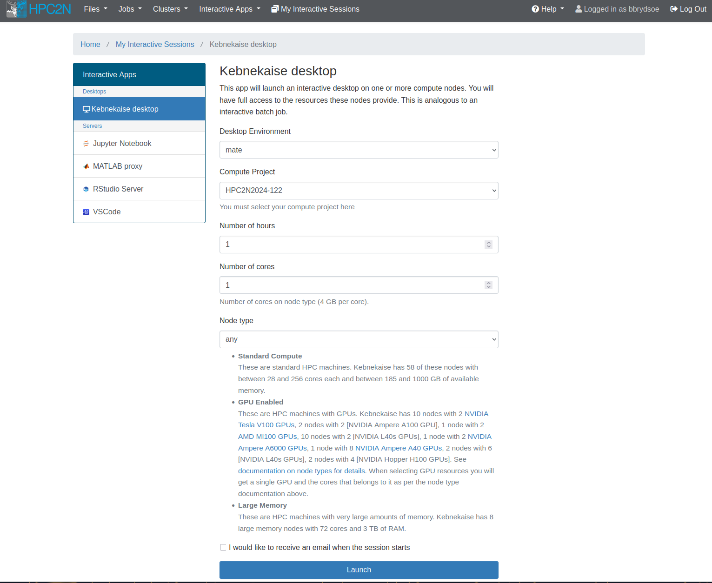
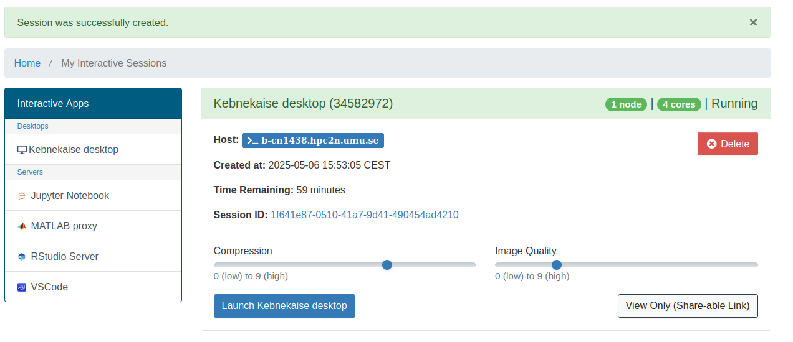

# The Batch System (SLURM)  

!!! Objectives

    - Get information about what a batch system is and which one is used at HPC2N.
    - Learn basic commands for the batch system used at HPC2N. 
    - How to create a basic batch script. 
    - Managing your job: submitting, status, cancelling, checking... 
    - Learn how to allocate specific parts of Kebnekaise: skylake, zen3/zen4, GPUs... 
    - Start a batch job (interactive app) through Open OnDemand desktop. 

- Large/long/parallel jobs **must** be run through the batch system.
- Kebnekaise is running <a href="http://slurm.schedmd.com/" target="_blank">Slurm</a>. 
- Slurm is an Open Source job scheduler, which provides three key functions.
    - Keeps track of available system resources.
    - Enforces local system resource usage and job scheduling policies. 
    - Manages a job queue, distributing work across resources according to policies. 
- In order to run a batch job, you need to create and submit a SLURM submit file (also called a batch submit file, a batch script, or a job script).
- Starting an interactive session through Open OnDemand also runs a batch job. It starts on a compute node. We will look at Open OnDemand at the end of this section. 

!!! Note

    Guides and documentation for the batch system at HPC2N here at: <a href="https://docs.hpc2n.umu.se/documentation/batchsystem/intro/" target="_blank">HPC2N's batch system documentation</a>. 

## Basic commands

Using a job script is often recommended. 

- If you ask for the resources on the command line, you will wait for the program to run before you can use the window again (unless you can send it to the background with &).
- If you use a job script you have an easy record of the commands you used, to reuse or edit for later use.

!!! NOTE

    When you submit a job, the system will return the Job ID. You can also get it with ``squeue --me``. See below. 

In the following, JOBSCRIPT is the name you have given your job script and JOBID is the job ID for your job, assigned by Slurm. USERNAME is your username. 

- **Submit job**: ``sbatch JOBSCRIPT`` 
- **Get list of your jobs**: ``squeue -u USERNAME`` or ``squeue --me``
- **Give the Slurm commands on the command line**: ``srun commands-for-your-job/program`` 
- **Check on a specific job**: ``scontrol show job JOBID`` 
- **Delete a specific job**: ``scancel JOBID``
- **Delete all your own jobs**: ``scancel -u USERNAME``
- **Request an interactive allocation**: ``salloc -A PROJECT-ID .......`` 
    - Note that you will still be on the login node when the prompt returns and you MUST preface with ``srun`` to run on the allocated resources.
    - I.e. ``srun MYPROGRAM``
- **Get more detailed info about jobs**: <br>``sacct -l -j JOBID -o jobname,NTasks,nodelist,MaxRSS,MaxVMSize``
    - More flags etc. can be found with ``man sacct``
    - The output will be **very** wide. To view in a friendlier format, use <br>``sacct -l -j JOBID -o jobname,NTasks,nodelist,MaxRSS,MaxVMSize | less -S`` 
        - this makes it sideways scrollable, using the left/right arrow key
- Web url with graphical info about a job: ``job-usage JOBID``
- More information: ``man sbatch``, ``man srun``, ``man ....``

!!! note "Example: done in a terminal" 

    Submit job with ``sbatch``

    ```bash
    b-an01 [~]$ sbatch simple.sh 
    Submitted batch job 27774852
    ```

    Check status with ``squeue --me``

    ```bash
    b-an01 [~]$ squeue --me
             JOBID PARTITION     NAME     USER ST       TIME  NODES NODELIST(REASON)
          27774852  cpu_zen4 simple.s bbrydsoe  R       0:00      1 b-cn1701
    ``` 

    Submit several jobs (here several instances of the same), check on the status

    ```bash
    b-an01 [~]$ sbatch simple.sh 
    Submitted batch job 27774872
    b-an01 [~]$ sbatch simple.sh 
    Submitted batch job 27774873
    b-an01 [~]$ sbatch simple.sh 
    Submitted batch job 27774874
    b-an01 [~]$ squeue --me
                JOBID PARTITION     NAME     USER ST       TIME  NODES NODELIST(REASON)
             27774873  cpu_zen4 simple.s bbrydsoe  R       0:02      1 b-cn1702
             27774874  cpu_zen4 simple.s bbrydsoe  R       0:02      1 b-cn1702
             27774872  cpu_zen4 simple.s bbrydsoe  CG      0:04      1 b-cn1702
    ``` 

    The status "R" means it is running. "CG" means completing. When a job is pending it has the state "PD". 

    In these examples the jobs all ended up on nodes in the partition cpu_zen4. We will soon talk more about different types of nodes. 

## Job scripts and output 

The official name for batch scripts in Slurm is Job Submission Files, but here we will use both names interchangeably. If you search the internet, you will find several other names used, including Slurm submit file, batch submit file, batch script, job script. 

A job submission file can contain any of the commands that you would otherwise issue yourself from the command line. It is, for example, possible to both compile and run a program and also to set any necessary environment values (though remember that Slurm exports the environment variables in your shell per default, so you can also just set them all there before submitting the job).

!!! note 

    The results from compiling or running your programs can generally be seen after the job has completed, though as Slurm will write to the output file during the run, some results will be available quicker.

Outputs and any errors will per default be placed in the directory you are running from, though this can be changed.

!!! Note 

    This directory should preferrably be placed under your project storage, since your home directory only has 25 GB of space. 

The output file from the job run will default be named ``slurm-JOBID.out``. It will contain both output as well as any errors. You can look at the content with ``vi``, ``nano``, ``emacs``, ``cat``, ``less``…

The exception is if your program creates its own output files, or if you name the output file(s) differently within your jobscript.

!!! note 

    You can use Slurm commands within your job script to split the error and output in separate files, and name them as you want. It is highly recommended to include the environment variable ``%J`` (the job ID) in the name, as that is an easy way to get a new name for each time you run the script and thus avoiding the previous output being overwritten.

    Example, using the environment variable ``%J``:

    - Error file: ``#SBATCH --error=job.%J.err``
    - Output file: ``#SBATCH --output=job.%J.out``

### Job scripts 

A job submission file can either be very simple, with most of the job attributes specified on the command line, or it may consist of several Slurm directives, comments and executable statements. A Slurm directive provides a way of specifying job attributes in addition to the command line options.

**Naming**: You can name your script anything, including the suffix. It does not matter. Just name it something that makes sense to you and helps you remember what the script is for. The standard is to name it with a suffix of ``.sbatch`` or ``.sh``.

**Simple, serial job script**

```bash
#!/bin/bash
# The name of the account you are running in, mandatory.
#SBATCH -A hpc2nXXXX-YYY
# Request resources - here for a serial job
# tasks per core is 1 as default (can be changed with ``-c``)
#SBATCH -n 1
# Request runtime for the job (HHH:MM:SS) where 168 hours is the maximum. Here asking for 15 min. 
#SBATCH --time=00:15:00 

# Clear the environment from any previously loaded modules
module purge > /dev/null 2>&1

# Load the module environment suitable for the job - here foss/2023b 
module load foss/2023b

# And finally run the serial jobs 
./my_serial_program
```

!!! Note

    - You have to always include ``#!/bin/bash`` at the beginning of the script, since bash is the only supported shell. Some things may work under other shells, but not everything.
    - All Slurm directives start with ``#SBATCH``.
    - One (or more) ``#`` in front of a text line means it is a comment, with the exception of the string ``#SBATCH``. In order to comment out the Slurm directives, you need to put one more ``#`` in front of the ``#SBATCH``.
    - It is important to use capital letters for ``#SBATCH``. Otherwise the line will be considered a comment, and ignored.

Let us go through the most commonly used arguments:

- **-A PROJ-ID**: The project that should be accounted. It is a simple conversion from the SUPR project id. You can also find your project account with the command ``projinfo``. The **PROJ-ID** argument is of the form
    - hpc2nXXXX-YYY (HPC2N local project)
- **-N**: number of nodes. If this is not given, enough will be allocated to fullfill the requirements of -n and/or -c. A range can be given. If you ask for, say, 1-1, then you will get 1 and only 1 node, no matter what you ask for otherwise. It will also assure that all the processors will be allocated on the same node.
- **-n**: number of tasks. 
- **-c**: cores per task. Request that a specific number of cores be allocated to each task. This can be useful if the job is multi-threaded and requires more than one core per task for optimal performance. The default is one core per task.

**Simple MPI program** 

```bash 
#!/bin/bash
# The name of the account you are running in, mandatory.
#SBATCH -A hpc2nXXXX-YYY
# Request resources - here for eight MPI tasks
#SBATCH -n 8
# Request runtime for the job (HHH:MM:SS) where 168 hours is the maximum. Here asking for 15 min. 
#SBATCH --time=00:15:00 

# Clear the environment from any previously loaded modules
module purge > /dev/null 2>&1

# Load the module environment suitable for the job - here foss/2023b 
module load foss/2023b

# And finally run the job - use srun for MPI jobs, but not for serial jobs 
srun ./my_mpi_program
```

## Prepare the exercise environment

!!! note

    If you have not already done so, clone the material from the website <a href="https://github.com/hpc2n/intro-course" target="_blank">https://github.com/hpc2n/intro-course</a>: 

    1. Change to the storage directory you created under ``/proj/nobackup/fall-courses/``. 
    2. Clone the material: 
    ```bash
    git clone https://github.com/hpc2n/intro-course.git
    ```
    3. Change to the subdirectory with the exercises:
    ```bash
    cd intro-course/exercises/simple
    ```

    You will now find several small programs and batch scripts which are used in this section and the next, "Simple examples". 

In this section, we are just going to try submitting a few jobs, checking their status, cancelling a job, and looking at the output. 

!!! Note "Preparations"

    1. Load the module ``foss/2023b`` (``ml foss/2023b``) on the regular login node (regular SSH or terminal opened in ThinLinc). This module is available on all nodes. 
    2. Compile the following programs: ``hello.c``, ``mpi_hello.c``, ``mpi_greeting.c``, and ``mpi_hi.c``
    ```bash
    gcc -o hello hello.c
    mpicc -o mpi_hello mpi_hello.c
    mpicc -o mpi_greeting mpi_greeting.c
    mpicc -o mpi_hi mpi_hi.c
    ```
    3. If you compiled and named the executables as above, you should be able to submit the following batch scripts directly: ``simple.sh``, ``mpi_greeting.sh``, ``mpi_hello.sh``, ``mpi_hi.sh``, ``multiple-parallel-sequential.sh``, ``multiple-parallel.sh``, or ``multiple-parallel-simultaneous.sh``. 

### Exercises

!!! Exercise "Exercise: sbatch and squeue"

    Submit (``sbatch``) one of the batch scripts listed in 3. under preparations. 

    Check with ``squeue --me`` if it is running, pending, or completing. 

!!! Exercise "Exercise: sbatch and scontrol show job" 

    Submit a few instances of ``multiple-parallel.sh`` and ``multiple-parallel-sequential.sh`` (so they do not finish running before you have time to check on them).

    Do ``scontrol show job JOBID`` on one or more of the job IDs. You should be able to see node assigned (unless the job has not yet had one allocated), expected runtime, etc. If the job is running, you can see how long it has run. You will also get paths to submit directory etc. 

!!! Exercise "Exercise: sbatch and scancel"  

    Submit a few instances of ``multiple-parallel.sh`` and ``multiple-parallel-sequential.sh`` (so they do not finish running before you have time to check on them).

    Do ``squeue --me`` and see the jobs listed. Pick one and do ``scancel JOBID`` on it. Do ``squeue --me`` again to see it is no longer there. 

!!! Exercise "Exercise: check output, change output files"

    1. Use ``nano`` to open one of the output files ``slurm-JOBID.out`` and looks at the content. 

    2. Try adding ``#SBATCH --error=job.%J.err`` and ``#SBATCH --output=job.%J.out`` to one of the batch scripts (you can edit it with ``nano``). Submit the batch script again. See that the expected files get created. 

## Using the different parts of Kebnekaise 

As mentioned under the introduction, Kebnekaise is a very heterogeneous system, comprised of several different types of CPUs and GPUs. The batch system reflects these several different types of resources. 

At the top we have partitions, which are similar to queues. Each partition is made up of a specific set of nodes. At HPC2N we have three classes of partitions, one for CPU-only nodes, one for GPU nodes and one for large memory nodes. Each node type also has a set of features that can be used to select (constrain) which node(s) the job should run on.

!!! note 

    The three types of nodes also have corresponding resources one must apply for in SUPR to be able to use them.

While Kebnekaise has multiple partitions, one for each major type of resource, there is only a single partition, ``batch``, that users can submit jobs to. The system then figures out which partition(s) the job should be sent to, based on the requested features (constraints). 

!!! NOTE "Node overview" 

    The "Type" can be used if you need a specific type of node. More about that later. 

    **CPU-only nodes**

    | CPU | Memory/core | number nodes | Type | 
    | ---- | ----------- | ------------ | -------- |
    | 2 x 14 core Intel skylake | 6785 MB | 52 | skylake (intel_cpu) | 
    | 2 x 64 core AMD zen3 | 8020 MB | 1 | zen3 (amd_cpu) | 
    | 2 x 128 core AMD zen4 | 2516 MB | 8 | zen4 (amd_cpu) | 

    **GPU enabled nodes**

    | CPU | Memory/core | GPU card | number nodes | Type | 
    | ---- | ----------- | -------- | ------------ | -------- | 
    | 2 x 14 core Intel skylake | 6785 MB | 2 x Nvidia V100 | 10 | v100 | 
    | 2 x 24 core AMD zen3 | 10600 MB | 2 x Nvidia A100 | 2 | a100 | 
    | 2 x 24 core AMD zen3 | 10600 MB | 2 x AMD MI100 | 1 | mi100 | 
    | 2 x 24 core AMD zen4 | 6630 MB | 2 x Nvidia A6000 | 1 | a6000 | 
    | 2 x 24 core AMD zen4 | 6630 MB | 2 x Nvidia L40s | 10 | l40s | 
    | 2 x 48 core AMD zen4 | 6630 MB | 4 x Nvidia H100 SXM5 | 2 | h100 | 
    | 2 x 32 core AMD zen4 | 11968 MB | 6 x Nvidia L40s | 2 | l40s | 
    | 2 x 32 core AMD zen4 | 11968 MB | 8 x Nvidia A40 | 2 | a40 | 

    **Large memory nodes**
 
    | CPU | Memory/core | number nodes | Type | 
    | ---- | ----------- | ------------ | ---- | 
    | 4 x 18 core Intel broadwell | 41666 MB | 8 | largemem |  

### Requesting features

To make it possible to target nodes in more detail there are a couple of features defined on each group of nodes. To select a feature one can use the ``-C`` option to ``sbatch`` or ``salloc``. This sets *constraints* on the job.

There are several reasons why one might want to do that, including for benchmarks, to be able to replicate results (in some cases), because specific modules are only available for certain architectures, etc. 

To constrain a job to a certain feature, use 

```bash
#SBATCH -C Type
```

!!! note 

    Features can be combined using “and” (``&``) or “or” (``|``). They should be wrapped in ``'``'s.

    Example: 

    ```bash
    #SBATCH -C 'zen3|zen4'
    ``` 

List of constraints: 

!!! Note "For selecting type of CPU"

    Type is:

    - intel_cpu
    - broadwell
    - skylake
    - amd_cpu
    - zen3
    - zen4

!!! Note "For selecting type of GPU"

    Type is:

    - v100
    - a40
    - a6000
    - a100
    - l40s
    - h100
    - mi100

For GPUs, the above GPU list of constraints can be used either as a specifier to ``--gpus=type:number`` or as a constraint together with an unspecified gpu request ``--gpus=number`` or ``gpus-per-node=number``.

!!! Note 

    For some MPI jobs, ``mpirun`` may fail on some GPU nodes if you specify GPUs with <br>``--gpus=type:number`` instead of using ``--gpus-per-node=number`` and a constraint for type of GPU. 

    The problem should not appear if you use ``srun`` instead of ``mpirun``

!!! Note "For selecting GPUs with certain features"

    Type is: 
  
    - nvidia_gpu (Any Nvidia GPU)
    - amd_gpu (Any AMD GPU)
    - GPU_SP (GPU with single precision capability)
    - GPU_DP (GPU with double precision capability)
    - GPU_AI (GPU with AI features, like half precisions and lower)
    - GPU_ML (GPU with ML features, like half precisions and lower)

!!! Note "For selecting large memory nodes"

    Type is: 

    - largemem

!!! important "More memory"

    Aside from using the large memory nodes, you can also ask for more cores than you need (with ``-c #cores`` / ``--cores-per-task #cores``) and then only use some of them for running on, with the rest providing extra memory. 

    Example: you need 4 cores but twice as much memory as they have. You ask for 8 cores and say 2 cores-per-task (1 is default): 

    ```bash
    ...
    #SBATCH -n 8
    #SBATCH -c 2
    ... 
    ``` 

#### Examples, constraints 

!!! Note "Only nodes with Zen4"

     ```bash    
     #SBATCH -C zen4
     ```

!!! Note "Nodes with a combination of features: a Zen4 CPU and a GPU with AI features"

    ```bash
    #SBATCH -C 'zen4&GPU_AI'
    ```

!!! Note "Nodes with either a Zen3 CPU or a Zen4 CPU" 

    ```bash
    #SBATCH -C 'zen3|zen4'
    ```

#### Examples, requesting GPUs

To use GPU resources one has to explicitly ask for one or more GPUs. Requests for GPUs can be done either in total for the job or per node of the job.

!!! note "Ask for one GPU of any kind"

    ```bash
    #SBATCH --gpus=1
    ```

!!! note "Another way to ask for one GPU of any kind"

    ```bash
    #SBATCH --gpus-per-node=1
    ```

!!! note "Asking for a specific type of GPU"

    As mentioned before, for GPUs, constraints can be used either as a specifier to 
 
    ``--gpus=type:number`` 

    or as a constraint together with an unspecified gpu request 

    ``--gpus=number``

    or 

    ``--gpus-per-node=number``

    If doing one of the latter two, you need to add the constraint 

    ``#SBATCH -C type``

    In the batch job you would write something like this: 

    ```bash
    #SBATCH --gpus=number
    #SBATCH -C type
    ```

    where type is, as mentioned:  

    - v100
    - a40
    - a6000
    - a100
    - l40s
    - h100
    - mi100

**Simple GPU Job - V100**

```bash
#!/bin/bash
#SBATCH -A hpc2nXXXX-YYY
# Expected time for job to complete 
#SBATCH --time=00:10:00
# Number of GPU cards needed. Here asking for 2 V100 cards
#SBATCH --gpus=2
#SBATCH -C v100 

# Clear the environment from any previously loaded modules
module purge > /dev/null 2>&1
# Load modules needed for your program - here fosscuda/2020b
ml fosscuda/2020b

./my-gpu-program
```

!!! Important

    - The course project has the following project ID: hpc2n2025-151
    - In order to use it in a batch job, add this to the batch script: ``#SBATCH -A hpc2n2025-151`` 
    - We have a storage project linked to the compute project: **fall-courses**. 
        - You find it in ``/proj/nobackup/fall-courses``. 
        - Remember to create your own directory under it. 

## Open OnDemand desktop 

Open OnDemand is a web service that allows HPC users to schedule jobs, run notebooks and work interactively on a remote cluster from any device that supports a modern browser.

### Kebnekaise desktop

This is the first submenu point, under “Interactive Apps” -> “Desktops”. 

This is used to start a desktop on one or more of the compute nodes after you have been allocated resources. This means you will be able to work as if on that node. That means that anything you run from the desktop immediately runs on the allocated resources, without you having to start (another) job.

Very useful if you want to work interactively with one of the installed pieces of software or your own code.

In addition to starting programs from the terminal, there are various applications available directly from the menu, like Libreoffice and Firefox. 

When you choose this, there are some options: 

- **Desktop Environment**: Here you can choose either “mate” (resembles Gnome 2/classic) or “xfce” (lightweight and fast). Personal preferrence.
- **Compute Project**: Dropdown menu where you can choose (one of) your compute projects to launch with.
- **Number of hours**: How long you want the job available for. Here you can choose 1-12 hours, but beware that it is a bad idea to pick longer than you need. Not only will it take longer to start, but it will also use up your allocation even if you are not actively doing anything on the desktop. Pick as long as you need to do your job.
- **Number of cores**: How many cores you want access to. You can choose 1-28 and they each have 4GB memory. This is only a valid field to choose if you pick “any” or “Large memory” for the “Node type” selection.
- **Node type**: Here you can choose “any”, “any GPU”, or “Large memory”. If you pick “any GPU” you will not pick anything for “Number of cores”.



!!! note "Exercise: start an instance of the "Kebnekaise desktop" and play with it"

    - Pick "compute project" as ``fall-courses``
    - Pick "number of hours" to ``1`` so it starts fast. 
    - Pick "Number of cores" to something between ``1-4``
    - Pick "any" for "Node type" 
    - Click "Launch" and wait for it to launch. It will say something like "Your session is currently starting... Please be patient as the process can take a few minutes." What happens here is that it is sitting in the queue and waiting for resources to be available and allocated. 
    - When resources are allocated, it will look something like this, where it gives the host node: 
    
    - You can now go to the desktop on the compute node with "Launch Kebnekaise desktop". 
    - Look around, see that you can use a filetree, open terminals (do so and see the cores are on the node that was shown as host), etc. 
        - A terminal is opened from "Applications" -> "System Tools" -> "MATE terminal" (or Xfce if you picked that). 
    - If you asked for more than one core, you can do ``srun /bin/hostname`` in the terminal and see a list of nodes. 
    - You can go to the ``/proj/nobackup/fall-courses/<your-dir>/intro-course/exercises`` directory and into the ``simple`` directory. Try run something directly on the command line - remember to load modules and compile if needed. 
        - Example: run the small Python program ``mmmult.py``
            - Load some modules: ``module load GCC/12.3.0 Python/3.11.3 SciPy-bundle/2023.07``
            - Run it: ``python mmmult.py`` (in directory "simple")
        - Example: Python and graphics 
            - Load some modules: ``module load GCC/12.3.0 Python/3.11.3 SciPy-bundle/2023.07 matplotlib/3.7.2 Tkinter/3.11.3``
            - Start Python and plot something with the dataset "scottish_hills.csv" (in directory "simple")
            ```py
            import pandas as pd
            import matplotlib
            import matplotlib.pyplot as plt
            matplotlib.use('TkAgg')
            dataframe = pd.read_csv("scottish_hills.csv")
            x = dataframe.Height
            y = dataframe.Latitude
            plt.scatter(x, y)
            plt.show()    
            ```

### Jupyter, MATLAB, RStudio, VSCode 

Aside from starting a Kebnekaise desktop and running programs from there, you can also start some specific applications, namely 

- Jupyter notebook
- MATLAB
- RStudio
- VSCode

They are started in much the same way as the Kebnekaise desktop, with the exception that you can generally pick a "Runtime environment" and/or a "Working Directory" to start in. The latter is picked by clicking and choosing in the filebrowser that opens. 

There are more information here: <a href="https://docs.hpc2n.umu.se/tutorials/connections/#open__ondemand" target="_blank">Open OnDemand desktop in HPC2N's documentation</a>. 

#### Runtime environment and multicore jobs 

This is used if you have created your own environment you want to run in, for instance by adding extra and/or own installed Python modules or R packages. 

- In order to use Jupyter with extra modules, you can follow this documentation I have made here: <a href="https://docs.hpc2n.umu.se/tutorials/connections/#example__-__jupyter__with__extra__modules" target="_blank">Jupyter with extra modules</a>. 
- Using R with your own runtime environment I have described here: <a href="https://docs.hpc2n.umu.se/tutorials/connections/#example__-__running__on__the__multicore__allocation" target="_blank">R with own runtime environment</a>.
- Running MATLAB as a multicore job is described here: <a href="https://docs.hpc2n.umu.se/tutorials/connections/#example__-__running__multicore__job" target="_blank">MATLAB with multicores</a>

!!! note "Open OnDemand vs. regular batch script" 

    - Open OnDemand is good for 
        - shorter (<12 hours) jobs that requires more interactivity
        - interactivity in general
        - graphics
    - Batch scripts are better for
        - longer jobs
        - very parallel jobs (more than 28 cores)
        - multi-step jobs / workflows
        - any job that can run on its own without input

!!! keypoints "Keypoints" 

    - To submit a job, you first need to create a batch submit script, which you then submit with ``sbatch SUBMIT-SCRIPT``. 
    - You can get a list of your running and pending jobs with ``squeue --me``. 
    - Kebnekaise has many different nodes, both CPU and GPU. It is possible to constrain the the job to run only on specific types of nodes. 
    - If your job is an MPI job, you need to use ``srun`` (or ``mpirun``) in front of your executable in the batch script (unless you use software which handles the parallelization itself). 
    - The Open OnDemand (OOD) desktop is also using allocated resources and anything you run there is run directly on the allocated compute nodes
    - OOD is good for interactivity and a simple way to allocate resources 

