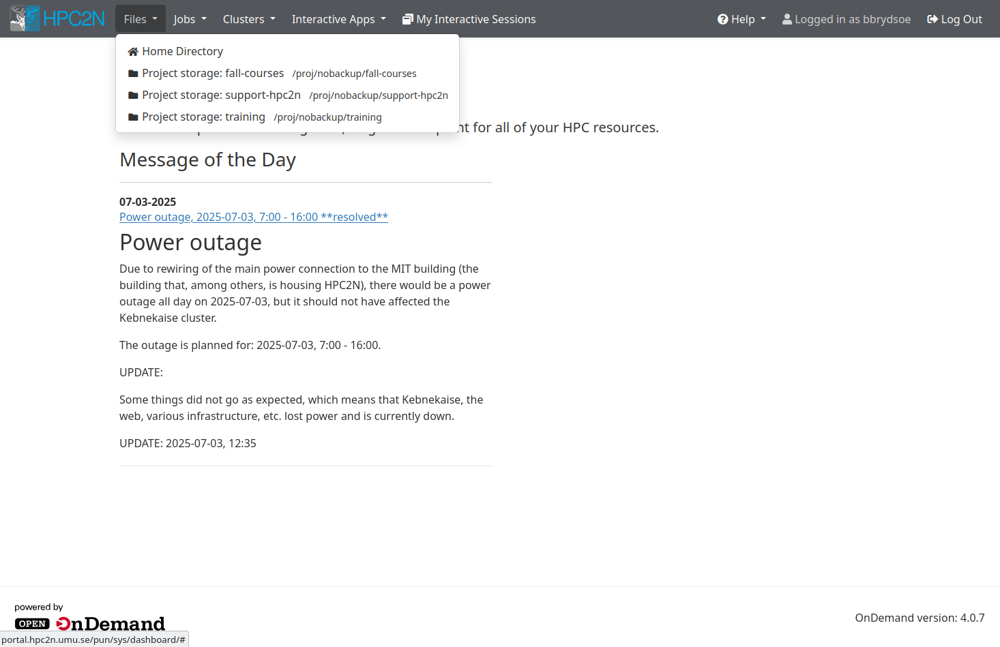
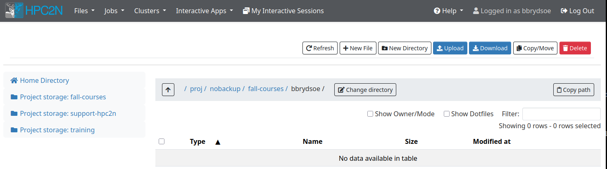
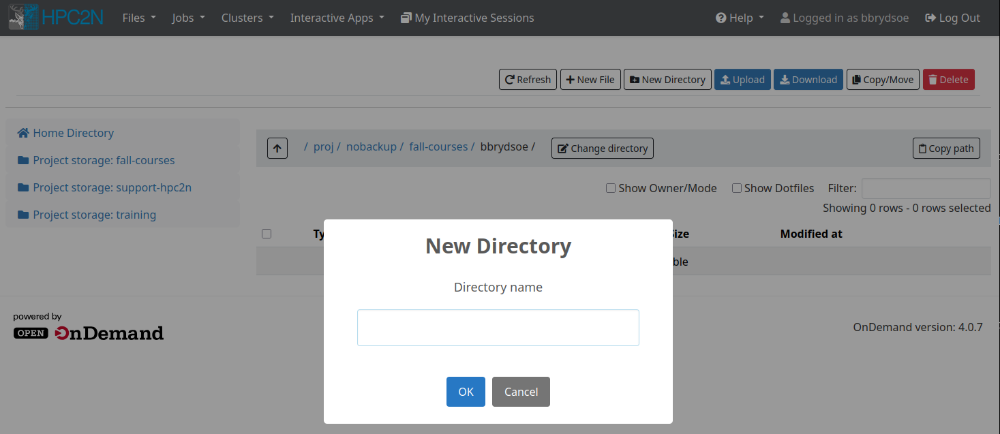

# The File System

!!! note "Objectives" 

    - Learn about the file system on Kebnekaise
    - Find the project storage for this course and create your own subdirectory (terminal through SSH or ThinLinc) 
    - Try also to create a directory through Open OnDemand desktop with the option "Files"

## Overview

|   | **Project storage** | **$HOME** | **/scratch** | 
| - | ------------------- | --------- | ------------ | 
| Recommended for <br>batch jobs | Yes | No (size) | Yes | 
| Backed up | No | Yes | No |  
| Accessible by <br>batch system | Yes | Yes | Yes (node only) |  
| Performance | High | High | Medium |
| Default readability | Group only | Owner | Owner |  
| Permissions <br>management | chmod, chgrp, ACL | chmod, chgrp, ACL | N/A for batch jobs | 
| Notes | Storage your group get <br>allocated through the <br>storage projects | Your home-directory | Per node | 
  
## $HOME

This is your home-directory (pointed to by the <code>$HOME</code> variable). It has a quota limit of 25GB per default. Your home directory is backed up regularly.

!!! note 
  
    Since the home directory is quite small, it should not be used for most production jobs. These should instead be run from project storage directories.

To find the path to your home directory, either run <code>pwd</code> just after logging in, or do the following:

```bash
b-an01 [~/store]$ cd
b-an01 [~]$ pwd
/home/u/username
b-an01 [~]$
```

## Project storage

Project storage is where a project’s members have the majority of their storage. It is applied for through SUPR, as a storage project. While storage projects needs to be applied for separately, they are usually linked to a compute project.

This is where you should keep your data and run your batch jobs from. It offers high performance when accessed from the nodes making it suitable for storage that are to be accessed from parallel jobs, and your home directory (usually) has too little space.

Project storage is located below <code>/proj/nobackup/</code> in the directory name selected during the creation of the proposal.

!!! Note

    The project storage is not intended for permanent storage and there is NO BACKUP of <code>/proj/nobackup</code>.

### Using project storage

- If you have a storage project, you should use that to run your jobs.
- You (your PI) will either choose a directory name when you/they apply for the storage project or get the project id as default name.
- The location of the storage project in the file system is <code>/proj/nobackup/NAME-YOU-PICKED</code>
- Since the storage project is shared between all users of the project, you should go to that directory and create a subdirectory for your things, which you will then be using.- For this course the storage is in 
  ```bash
  /proj/nobackup/fall-courses
  ```

!!! note "Exercise - create a directory"
 
    This exercise is done **on the terminal**

    - Go to the course project storage and create a subdirectory for yourself. 

    **Note**: Remember, if you are logged in with ThinLinc, you get a terminal like this: go to the menu at the top. Click “Applications” → “System Tools” → “MATE Terminal”.

Now is a good time to prepare the course material and download the exercises, if you have not already done so. The easiest way to do so is by cloning the whole intro-course repository from GitHub. 

!!! note "Exercise"

    1. Go to the subdirectory you created under <code>/proj/nobackup/fall-courses</code>
    2. Clone the repository for the course: <code>git clone https://github.com/hpc2n/intro-course.git</code>

    You will get a directory called <code>intro-course</code>. Below it you will find a directory called "exercises" where the majority of the exercises for the batch system section is located.

#### OOD 

Now let us try creating a sub directory to your directory ``/proj/nobackup/fall-courses/<your-dir>``, but using Open OnDemand. 

!!! note "Exercise - use OOD to create a sub directory"

    1. Go to the browser window where you have logged in to Open OnDemand desktop. (<a href="../login/#hpc2n__open__ondemand__desktop" target="_blank">Help here if you are not logged in</a>.
    2. Click "Files" in the top menu 
    {: style="width: 500px"} 
    3. Pick the ``/proj/nobackup/fall-courses`` directory and change to your directory under it (for me, ``bbrydsoe``)<br>
    {: style="width: 500px"}<br> 
    You should have a subdirectory there called ``intro-course`` from cloning the material with the exercises. Do not enter that now. 
    4. Create a new directory under ``/proj/nobackup/fall-courses/<your-dir>`` and call it whatever since it is just a test.<br> 
    {: style="width: 500px"}

    You can also access the file tree from the interactive session "Kebnekaise desktop", when you have started that. We will do this later. 

### Quota

The size of the storage depends on the allocation. There are small, medium, and large storage projects, each with their own requirements. You can read about this on SUPR. The quota limits are specific for the project as such, there are no user level quotas on that space.

## /scratch

Our recommendation is that you use the project storage instead of <code>/scratch</code> when working on Compute nodes or Login nodes.

On the computers at HPC2N there is a directory called <code>/scratch</code>. It is a small local area split between the users using the node and it can be used for saving (temporary) files you create or need during your computations. Please do not save files in <code>/scratch</code> you don’t need when not running jobs on the machine, and please make sure your job removes any temporary files it creates.

!!! note

    When anybody need more space than available on <code>/scratch</code>, we will remove the oldest/largest files without any notices.

More information about the file system, as well as archiving and compressing files, at the <a href="https://docs.hpc2n.umu.se/documentation/filesystems/" target="_blank">HPC2N documentation about File Systems</a>. 

!!! Keypoints "Keypoints"

    - When you login to Kebnekaise, you will end up in your home-directory.
    - Your home-directory is in <code>/home/u/username</code> and is pointed to by the environment variable <code>$HOME</code>.
    - Your project storage is located in <code>/proj/nobackup/NAME-YOU-PICKED</code>
        - For this course it is <code>/proj/nobackup/fall-courses</code>.
        - The project storage is NOT backed up.
    - You can also access the file tree from the Open OnDemand desktop. 
    - You should run the batch jobs from your project storage. 
