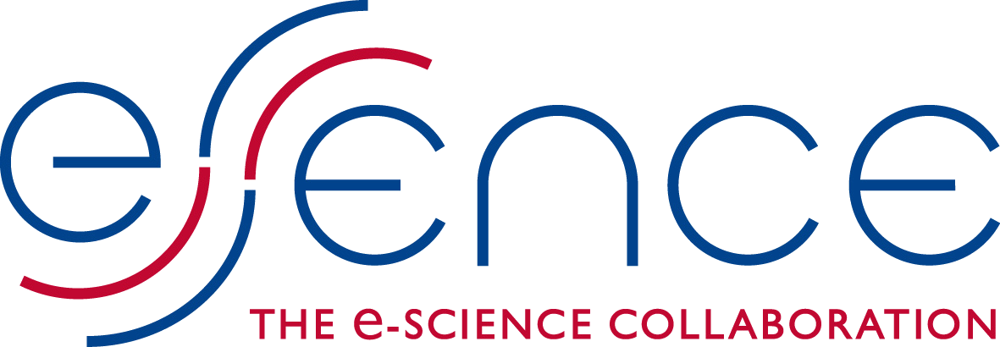
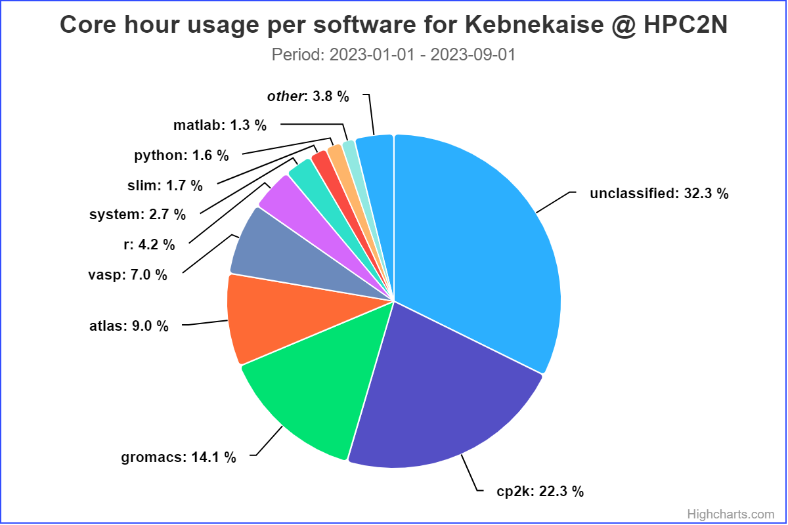

# Introduction to HPC2N, Kebnekaise and HPC

<!--- This document as well as the corresponding figures were created by
Mirko Myllykoski, Senior Research Engineer at CS/HPC2N, Umeå
University, for the January 2021 version of the "Introduction to
HPC2N" course. 
Various additions and changes by Birgitte Brydsö, HPC2N, Umeå University, for later versions. -->

{: style="height: 44px; float: left;"}
{: style="height: 44px;"}
{: style="height: 44px;"}

- Welcome page and syllabus: <a href="https://hpc2n.github.io/intro-linux/index.html">https://hpc2n.github.io/intro-linux/index.html</a>
    - Also link at the House symbol at the top of the page. 

## HPC2N

!!! note 

    High Performance Computing Center North (HPC2N) is 

    - a competence center for Scientific and Parallel Computing
    - part of **National Academic Infrastructure for Super­computing in Sweden (NAISS)**
    
HPC2N provides state-of-the-art resources and expertise:

- Scalable and parallel **HPC**
- Large-scale **storage facilities** (Project storage (Lustre), SweStore, Tape)
- **Grid and cloud** computing (WLCG NT1, Swedish Science Cloud)
- National Data Science Node in ”Epidemiology and Biology of Infections” (DDLS)
- Software for e-Science applications
- All levels of user support 
    - Primary, advanced, dedicated
    - Application Experts (AEs)

!!! note "Primary objective"

     To raise the national and local level of HPC competence and transfer HPC knowledge and technology to new users in academia and industry.

### HPC2N partners

HPC2N is hosted by:

{: style="height: 100px;float: left;"} 

  

Partners: 

{: style="height: 90px;float: left;padding: 4px;"} 
{: style="height: 90px;padding: 4px;"}
{: style="height: 90px;padding: 4px;"}
{: style="height: 90px;padding: 4px;"}

 

### HPC2N funding and collaborations

Funded mainly by **Umeå University**, with contributions from the **other HPC2N partners**.

Involved in several **projects and collaborations**: 

{: style="height: 85px; float: left;padding: 5px;"}
{: style="height: 85px;padding: 5px;"}
{: style="height: 80px;padding: 5px;"}

{: style="height: 90px;padding: 5px;"}
{: style="height: 85px;padding: 5px;"}
{: style="height: 95px;padding: 5px;"}

{: style="height: 90px;padding: 5px;"}
{: style="height: 90px;padding: 5px;"}

 

### HPC2N training and other services 

- **User support** (primary, advanced, dedicated)
    - Research group meetings @ UmU
    - Also at the partner sites
    - Online "HPC2N fika"  
- **User training and education program**
    - 0.5 -- 5 days; ready-to-run exercises
    - Introduction to Linux, 16 September 2024
    - Introduction to HPC2N and Kebnekaise, 16 September 2024
    - Parallel programming and tools (OpenMP, MPI, debugging, perf. analyzers, Matlab, R, MD simulation, ML, GPU, ...)
    - Basic Singularity, 16 October 2024
    - Introduction to running R, Python, Julia, and Matlab in HPC, 22-25 October 2024
    - Introduction to Git, 25-29 November 2024 
    - Using Python in an HPC environment, 5-6 December 2024
    - **Updated list:** https://www.hpc2n.umu.se/events/courses
- Workshops and seminars 
- NGSSC / SeSE & university courses

### HPC2N personnel

Management:

- Paolo Bientinesi, director
- Björn Torkelsson, deputy director
- Lena Hellman, administrator

Application experts:

- Jerry Eriksson
- Pedro Ojeda May
- Birgitte Brydsö
- Åke Sandgren

Others:

- Mikael Rännar (WLCG coord)
- Research Engineers under DDLS, HPC2N/SciLifeLab
    - Paul Dulaud, System Developer, IT
    - Abdullah Aziz, Data Engineer
    - Data Steward 

System and support:

- Erik Andersson
- **Birgitte Brydsö**
- Niklas Edmundsson (Tape coord)
- My Karlsson 
- Roger Oscarsson
- **Åke Sandgren**
- Mattias Wadenstein (NeIC, Tier1)
- **Lars Viklund**

### HPC2N application experts

- HPC2N provides advanced and dedicated support in the form of **Application Experts (AEs)**:
    - Jerry Eriksson: Profiling, Machine learning (DNN), MPI, OpenMP, OpenACC 
    - Pedro Ojeda May: Molecular dynamics, Profiling, QM/MM, NAMD, Amber, Gromacs, GAUSSIAN, R, Python 
    - Åke Sandgren: General high level programming assistance, VASP, Gromacs, Amber 
    - Birgitte Brydsö: General HPC, R, Python 
- Contact through regular support 

### HPC2N users by discipline

- Users from several scientific disciplines:
    - Biosciences and medicine 
    - Chemistry
    - Computing science  
    - Engineering 
    - Materials science
    - Mathematics and statistics 
    - Physics including space physics
    - ML, DL, and other AI

### HPC2N users by discipline, largest users
 
- Users from several scientific disciplines:
    - Biosciences and medicine 
    - **Chemistry**
    - Computing science  
    - Engineering 
    - **Materials science**
    - Mathematics and statistics 
    - **Physics including space physics**
    - **Machine learning and artificial intelligence** (several new projects)

### HPC2N users by software

## Kebnekaise

The current supercomputer at HPC2N. It is a very heterogeneous system. 

- Named after a massif (contains some of Sweden's highest mountain peaks)
- Kebnekaise was 
    - delivered by Lenovo and 
    - installed during the summer 2016
    - Opened up for general availability on November 7, 2016
    - In 2018, Kebnekaise was extended with 
        - 52 Intel Xeon Gold 6132 (Skylake) nodes, as well as 
        - 10 NVidian V100 (Volta) GPU nodes
    - In 2023, Kebnekaise was extended with 
        - 2 dual NVIDIA A100 GPU nodes
        - one many-core AMD Zen3 CPU node

Kebnekaise will be continuosly upgraded, as old hardware gets retired. 

- In 2024 Kebnekaise was extended with 
    - 2 Dual socket GPU-nodes: Lenovo ThinkSystem SR675 V3
        - 2 x AMD EPYC 9454 48C 290W 2.75GHz Processor
        - 768GB [24x 32GB TruDDR5 4800MHz RDIMM-A]
        - 1 x 3.84TB Read Intensive NVMe PCIe 4.0 x4 HS SSD
        - 1 x NVIDIA H100 SXM5 700W 80G HBM3 GPU Board
    - 10 dual-socket GPU-nodes: ThinkSystem SR665 V3
        - 2 x AMD EPYC 9254 24C 200W 2.9GHz Processor
        - 384GB [24x 16GB TruDDR5 4800MHz RDIMM-A]
        - 1 x 1.92TB Read Intensive NVMe PCIe 5.0 x4 HS SSD
        - 2 x NVIDIA L40S 48GB PCIe Gen4 Passive GPU
    - 8 dual-socket CPU only: ThinkSystem SR645 V3
        - 2 x AMD EPYC 9754 128C 360W 2.25GHz Processor
        - 768GB [24x 32GB TruDDR5 4800MHz RDIMM-A]
        - 1 x 1 3.84TB Read Intensive NVMe PCIe 4.0 x4 HS SSD

### Current hardware in Kebnekaise

Kebnekaise have CPU-only, GPU enabled and large memory nodes.

The CPU-only nodes are:

- 2 x 14 core Intel broadwell
    - 4460 MB memory / core
    - 48 nodes
- 2 x 14 core Intel skylake
    - 6785 MB memory / core
    - 52 nodes
- 2 x 64 core AMD zen3
    - 8020 MB / core
    - 1 node
- 2 x 128 core AMD zen4
    - 2516 MB / core
    - 8 nodes

The GPU enabled nodes are:

- 2 x 14 core Intel broadwell
    - 9000 MB memory / core
    - 2 x Nvidia A40
    - 4 nodes
- 2 x 14 core Intel skylake
    - 6785 MB memory / core
    - 2 x Nvidia V100
    - 10 nodes
- 2 x 24 core AMD zen3
    - 10600 MB / core
    - 2 x Nvidia A100
    - 2 nodes
- 2 x 24 core AMD zen3
    - 10600 MB / core
    - 2 x AMD MI100
    - 1 node
- 2 x 24 core AMD zen4
    - 6630 MB / core
    - 2 x Nvidia A6000
    - 1 node
- 2 x 24 core AMD zen4
    - 6630 MB / core
    - 2 x Nvidia L40s
    - 10 nodes
- 2 x 48 core AMD zen4
    - 6630 MB / core
    - 4 x Nvidia H100 SXM5
    - 2 nodes

The large memory nodes are:

- 4 x 18 core Intel broadwell
    - 41666 MB memory / core
    - 8 nodes

### Kebnekaise - HPC2N storage
  
Basically four types of storage are available at HPC2N: 

- Home directory
    - <code>/home/X/Xyz</code>, <code>\$HOME</code>, <code>~</code>
    - 25 GB, user owned
- Project storage
    - <code>/proj/nobackup/abc</code>
    - Shared among project members
- Local scratch space
    - <code>\$SNIC_TMP</code>
    - SSD (170GB), per job, per node, "volatile"
- Tape Storage
    - Backup
    - Long term storage

Also 

- **SweStore** --- disk based (dCache)
    - Research Data Storage Infrastructure, for active research data and operated by NAISS, WLCG

### Kebnekaise - projects

!!! note "Compute projects"
  
    To use Kebnekaise, you must be a member of a **compute project**.

    - A compute project has a certain number of **core hours** allocated for it per month
    - A regular CPU core cost 1 core hour per hour, other resources (e.g., GPUs) cost more
    - Not a hard limit but projects that go over the allocation get lower priority

A compute project contains a certain amount of storage. If more storage is required, you must be a member of a **storage project**. 

!!! note 

    As Kebnekaise is a local cluster, you need to be affiliated with UmU, IRF, SLU, Miun, or LTU to use it. 

Projects are applied for through SUPR (<a href="https://supr.naiss.se" target="_blank">https://supr.naiss.se</a>). 

I will cover more details in a later section, where we go more into detail about HPC2N and Kebnekaise. 

## HPC 

!!! note "What is HPC?"

    High Performance Computing (definition)

    "High Performance Computing most generally refers to the practice of **aggregating computing power** in a way that delivers much **higher performance** than one could get out of a typical desktop computer or workstation in order to **solve large problems** in science, engineering, or business."

    From: <a href="https://insidehpc.com/hpc-basic-training/what-is-hpc/" target="_blank">https://insidehpc.com/hpc-basic-training/what-is-hpc/</a> 

### High Performance Computing - opening the definition

 \item \emph{Aggregating computing power}
 \begin{itemize}
  \item 533 nodes in 15 racks totalling 16504 cores
  \item Compared to 4 cores in a modern laptop
 \end{itemize}
 \pause \item \emph{Higher performance}
 \begin{itemize}
  \item More than 728\,000\,\underline{000}\,\underline{000}\,\underline{000} arithmetical operations per second\footnote{728 trillion (billion)}
  \item Compared to 200\,\underline{000}\,\underline{000}\,\underline{000} Flops in a modern laptop\footnote{200 billion (milliard)\\}
 \end{itemize}
 \pause \item \emph{Solve large problems}
 \begin{itemize}
  \item When does a problem become large enough for HPC?
  \item Are there other reasons for using HPC resources? (Memory,
    software, support, etc.) 
 \end{itemize}
\end{itemize}
}

\frame{
\frametitle{High Performance Computing (large problems)}
\begin{itemize}
 \item A problem can be large for two main reasons:
 \begin{enumerate}
  \item {\color{cyan} Execution time}: The time required to form a solution to the problem is very long
  \item {\color{cyan} Memory / storage use}: The solution of the problem requires a lot of memory and/or storage
 \end{enumerate}
 \pause \item The former can be remedied by \emph{increasing the performance}
 \begin{itemize}
  \item More cores, more nodes, GPUs, \dots
 \end{itemize}
 \pause \item The latter by \emph{adding more memory / storage}
 \begin{itemize}
  \item More memory per node (including large memory nodes), more nodes, \dots
  \item Kebnekaise: 128GB - 192GB, 512GB, 3TB
  \item Large storage solutions, \dots
 \end{itemize}
\end{itemize}
}

\frame{
\frametitle{High Performance Computing (what counts as HPC)}
\begin{center}
 \includegraphics[width=0.6\textwidth]{figures/hpc1.pdf}
\end{center}
}

\frame{
\frametitle{High Performance Computing (what counts as HPC)}
\begin{center}
 \includegraphics[width=0.6\textwidth]{figures/hpc2.pdf}
\end{center}
}

\frame{
\frametitle{High Performance Computing (what counts as HPC)}
\begin{center}
 \includegraphics[width=0.6\textwidth]{figures/hpc3.pdf}
\end{center}
}

\frame{
\frametitle{High Performance Computing (other reasons)}
\begin{itemize}
 \item Specialized (expensive) hardware
 \begin{itemize}
  \pause \item GPUs, \emph{Nvidia Tesla V100/A100 GPUs} are optimized for AI
%  \pause \item Intel Xeon Phi
  \pause \item High-end CPUs (AVX-512 etc) and ECC memory
 \end{itemize}
 \pause \item Software
 \begin{itemize}
  \item HPC2N holds \emph{licenses} for several softwares
  \item Software is \emph{pre-configured and ready-to-use}
 \end{itemize}
 \pause \item \emph{Support and documentation}
\end{itemize}
}

\frame{
\frametitle{High Performance Computing (memory models)}
\begin{itemize}
 \item Two memory models are relevant for HPC:
 \begin{itemize}
  \pause \item {\color{cyan} Shared memory}: Single memory space for all data.
   \begin{minipage}{0.3\textwidth}
   \vspace{1mm}
   \includegraphics[scale=0.45]{figures/sm.pdf}
   \vspace{1mm}
  \end{minipage}\,
  \begin{minipage}{0.4\textwidth}
   \begin{itemize}
    \item \emph{Everyone can access the same data}
    \item Straightforward to use
   \end{itemize}
  \end{minipage}
  \pause \item {\color{cyan} Distributed memory}: Multiple \emph{distinct} memory spaces.
  \begin{minipage}{0.3\textwidth}
   \vspace{1mm}
   \includegraphics[scale=0.45]{figures/dm.pdf}
   \vspace{1mm}
  \end{minipage}\,
  \begin{minipage}{0.4\textwidth}
   \begin{itemize}
    \item Everyone has direct access \emph{only to the local data}
    \item Requires \emph{communication}
   \end{itemize}
  \end{minipage}
 \end{itemize}
\end{itemize}
}

\frame{
\frametitle{High Performance Computing (memory models)}
\begin{center}
 \includegraphics[width=0.6\textwidth]{figures/memory.pdf}
\end{center}
}

\frame{
\frametitle{High Performance Computing (programming models)}
\begin{itemize}
 \item The programming model changes when we aim for extra performance and/or memory:
 \begin{enumerate}
  \pause \item {\color{cyan} Single-core}: Matlab, Python, C, Fortran, \dots
  \begin{itemize}
   \item Single stream of operations
  \end{itemize}
  \pause \item {\color{cyan} Multi-core}: Vectorized Matlab, pthreads, \emph{OpenMP}
  \begin{itemize}
   \item \emph{Multiple streams} of operations
   \pause \item \emph{Work distribution}, \emph{coordination} (synchronization, etc), \dots
  \end{itemize}
  \pause \item {\color{cyan} Distributed memory}: \emph{MPI}, \dots
  \begin{itemize}
   \item Multiple streams of operations
   \item Work distribution, coordination (synchronization, etc), \dots
   \pause \item \emph{Data distribution and communication}
  \end{itemize}
 \end{enumerate}
 \pause \item {\color{cyan} GPUs}: \emph{CUDA}, OpenCL, OpenACC, OpenMP, \dots
 \begin{itemize}
  \pause \item \emph{Many lightweight} streams of operations
  \pause \item Work distribution, coordination (synchronization, etc), \dots
  \pause \item \emph{Data distribution across memory spaces and movement}
 \end{itemize}
\end{itemize}
}

\frame{
\frametitle{High Performance Computing (software)}
\begin{itemize}
 \item Complexity grows when we aim for extra performance and/or memory/storage:
 \begin{enumerate}
  \pause \item {\color{cyan} Single-core}: LAPACK, \dots
  \begin{itemize}
   \item Load correct toolchain etc
  \end{itemize}
  \pause \item {\color{cyan} Multi-core}: LAPACK + parallel BLAS, \dots
  \begin{itemize}
   \item Load correct toolchain etc
   \pause \item \emph{Allocate} correct number of cores, \emph{configure} software to use correct number of cores, \dots
  \end{itemize}
  \pause \item {\color{cyan} Distributed memory}: ScaLAPACK, \dots
  \begin{itemize}
   \item Load correct toolchain etc
   \pause \item Allocate correct number of \emph{nodes and cores}, configure software to use correct number of \emph{nodes and cores}, \dots
   \pause \item Data distribution, storage, \dots
  \end{itemize}
 \end{enumerate}
 \pause \item {\color{cyan} GPUs}: MAGMA, TensorFlow, \dots
 \begin{itemize}
  \item Load correct toolchain etc
  \item Allocate correct number of \emph{cores and GPUs}, configure software to use correct number of \emph{cores and GPUs}, \dots
 \end{itemize}
\end{itemize}
}

\frame{
\frametitle{End (questions?)}
\centering \Huge Questions?
}

\end{document}

!!! Admonition "Learning outcomes"

    - What is Linux?
    - Learn about the command line interface (CLI)
    - Navigate the file system - ls, mkdir, cd, rm, cp, mv, redirection, pipes, etc.  
    - Data handling - compressing, archiving, file transfer, patterns, etc.  
    - Hints and tricks of Linux

## Why Linux 

- Most HPC centers supercomputers run some flavour of Linux. 
- It is stable and reliable
- Customizable
- Runs on any hardware
- Strong community
- Many flavours are open source and free
- Lots of applications
- Lightweight

## What is Linux

Linux is a family of open-source Unix-like operating systems based on the Linux kernel, an operating system kernel first released on September 17, 1991, by Linus Torvalds.

An operating system is the software that sits underneath all of the other software on a computer, managing the computer’s hardware (CPU, GPU, memory, storage...) and taking care of the connections between your other software and the hardware. 

Linux is typically packaged as a Linux distribution, which includes the kernel and supporting system software and libraries, many of which are provided by the GNU Project.

!!! Note "Distributions (distros)"

    There are many Linux distribuitions, including Ubuntu, Debian, Fedora, Gentoo, and many others. Many distributions are free and open source, but there are also commercial distributions, like Red Hat Enterprise and SUSE.

    Desktop Linux distributions include <a href="https://en.wikipedia.org/wiki/Desktop_environment" target="_blank">a desktop environment</a>, like GNOME, MATE, KDE Plasma, Xfce, Unity, or many others. A window manager together with applications written using a widget toolkit are generally responsible for most of what the user sees.

In addition, a windowing system of some sort (X11, Wayland) interfaces directly with the underlying operating system and libraries, providing support for graphical hardware, pointing devices, and keyboards. The window manager generally runs on top of this windowing system.

While the use of Linux on desktop is only 2-3%, the vast majority of web servers (>96%), most mobile devices (Android is based on the Linux kernel), and all supercomputers on the <a href="https://en.wikipedia.org/wiki/TOP500" target="_blank">Top500</a> list run Linux.

## More information 

There is much more information about <a href="https://en.wikipedia.org/wiki/Linux" target="_blank">Linux on Wikipedia</a>.

Some pages with guides and/or cheat sheets: 

- <a href="https://linuxhandbook.com/" target="_blank">The Linux Handbook</a>
- <a href="https://www.geeksforgeeks.org/linux-tutorial/" target="_blanks">https://www.geeksforgeeks.org/linux-tutorial/</a>
- <a href="https://itsfoss.com/free-linux-training-courses/" target="_blank">14 Free Training Courses to Learn Linux Online</a>
- <a href="https://tldp.org/LDP/intro-linux/intro-linux.pdf">Introduction to Linux - A Hands on Guide</a>
- <a href="https://cloudacademy.com/course/linux-fundmentals-1346/the-linux-directory-structure/" target="_blank">Linux Fundamentals</a>
- <a href="https://www.digitalocean.com/community/tutorials/linux-commands" target="_blank">Top 50+ Linux Commands You MUST Know</a>
 
