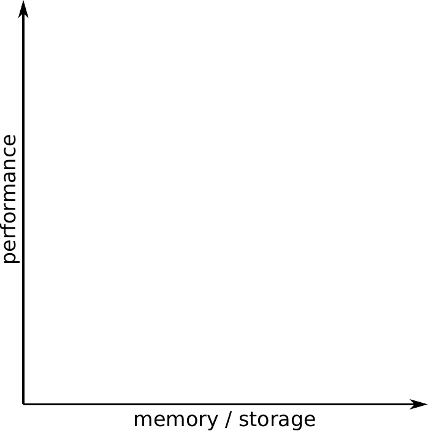
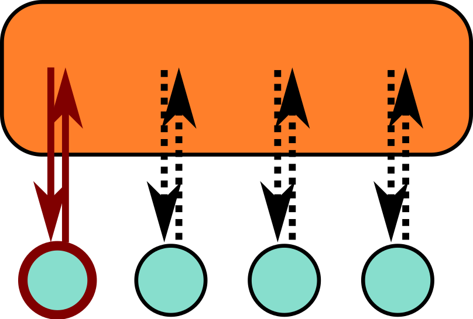
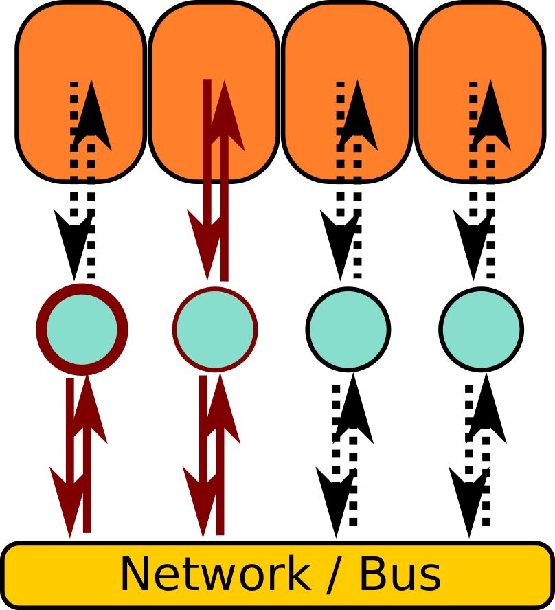
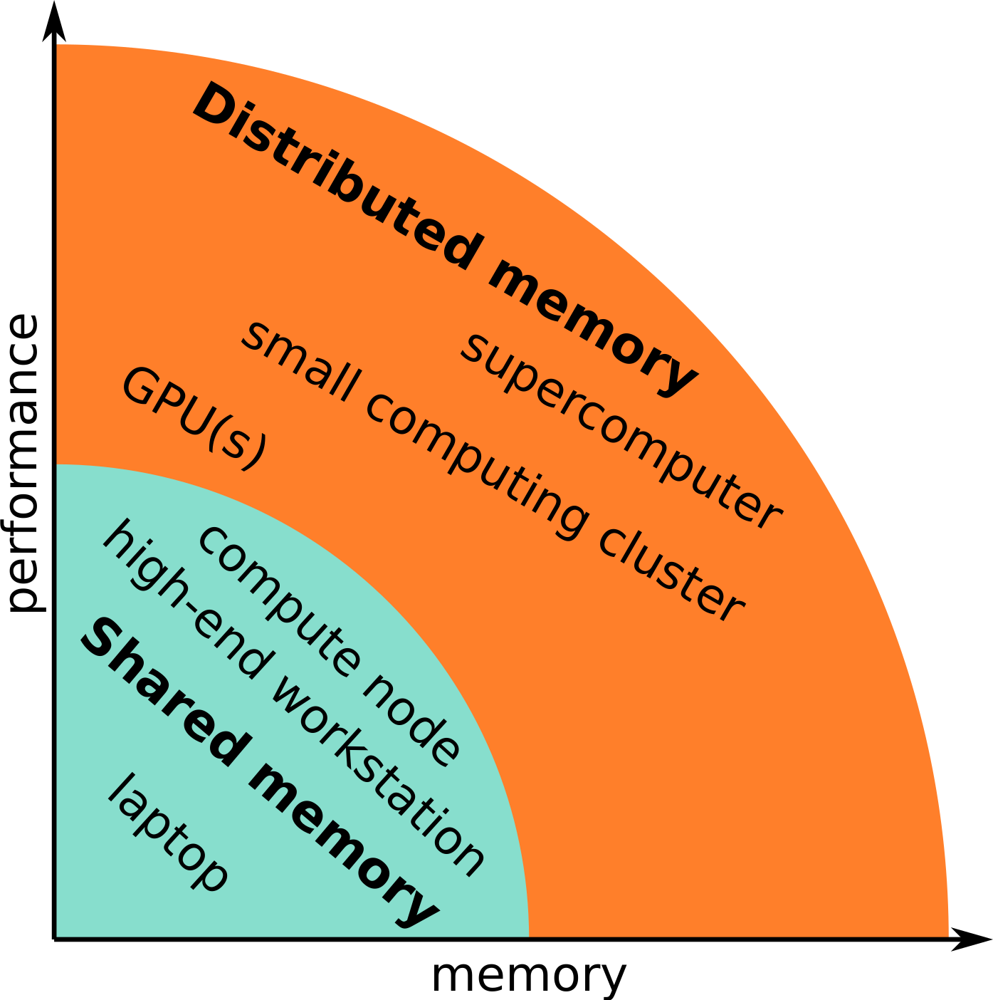

# Introduction to HPC2N, Kebnekaise and HPC

<!--- This document as well as the corresponding figures were created by
Mirko Myllykoski, Senior Research Engineer at CS/HPC2N, Umeå
University, for the January 2021 version of the "Introduction to
HPC2N" course. 
Various additions and changes, including porting to mkdocs by Birgitte Brydsö, HPC2N, Umeå University, for later versions. -->

{: style="height: 44px; float: left;"}
{: style="height: 44px;"}
{: style="height: 44px;"}

- Welcome page and syllabus: <a href="https://hpc2n.github.io/intro-linux/index.html">https://hpc2n.github.io/intro-linux/index.html</a>
    - Also link at the House symbol at the top of the page. 

## HPC2N

!!! note 

    High Performance Computing Center North (HPC2N) is 

    - a competence center for Scientific and Parallel Computing
    - part of **National Academic Infrastructure for Super­computing in Sweden (NAISS)**
    
HPC2N provides state-of-the-art resources and expertise:

- Scalable and parallel **HPC**
- Large-scale **storage facilities** (Project storage (Lustre), SweStore, Tape)
- **Grid and cloud** computing (WLCG NT1, Swedish Science Cloud)
- National Data Science Node in ”Epidemiology and Biology of Infections” (DDLS)
- Software for e-Science applications
- All levels of user support 
    - Primary, advanced, dedicated
    - Application Experts (AEs)

!!! note "Primary objective"

     To raise the national and local level of HPC competence and transfer HPC knowledge and technology to new users in academia and industry.

### HPC2N partners

HPC2N is hosted by:

{: style="height: 100px;float: left;"} 

  

Partners: 

{: style="height: 90px;float: left;padding: 4px;"} 
{: style="height: 90px;padding: 4px;"}
{: style="height: 90px;padding: 4px;"}
{: style="height: 90px;padding: 4px;"}

 

### HPC2N funding and collaborations

Funded mainly by **Umeå University**, with contributions from the **other HPC2N partners**.

Involved in several **projects and collaborations**: 

{: style="height: 85px; float: left;padding: 5px;"}
{: style="height: 85px;padding: 5px;"}
{: style="height: 80px;padding: 5px;"}

{: style="height: 90px;padding: 5px;"}
{: style="height: 85px;padding: 5px;"}
{: style="height: 95px;padding: 5px;"}

{: style="height: 90px;padding: 5px;"}
{: style="height: 90px;padding: 5px;"}

 

### HPC2N training and other services 

- **User support** (primary, advanced, dedicated)
    - Research group meetings @ UmU
    - Also at the partner sites
    - Online "HPC2N fika"  
- **User training and education program**
    - 0.5 -- 5 days; ready-to-run exercises
    - intro courses: our system, Linux, R, Python, Julia, Matlab, Git
    - intermediate courses
    - - Parallel programming and tools (OpenMP, MPI, debugging, perf. analyzers, Matlab, R, MD simulation, ML, GPU, ...)
- **Courses this fall**
    - Introduction to Linux, 16 September 2024
    - Introduction to HPC2N and Kebnekaise, 16 September 2024
    - Basic Singularity, 16 October 2024
    - Introduction to running R, Python, Julia, and Matlab in HPC, 22-25 October 2024
    - Introduction to Git, 25-29 November 2024 
    - Using Python in an HPC environment, 5-6 December 2024
    - **Updated list:** <a href="https://www.hpc2n.umu.se/events/courses" target="_blank">https://www.hpc2n.umu.se/events/courses</a> 
- Workshops and seminars 
- NGSSC / SeSE & university courses

### HPC2N personnel

Management:

- Paolo Bientinesi, director
- Björn Torkelsson, deputy director
- Lena Hellman, administrator

Application experts:

- Jerry Eriksson
- Pedro Ojeda May
- Birgitte Brydsö
- Åke Sandgren

Others:

- Mikael Rännar (WLCG coord)
- Research Engineers under DDLS, HPC2N/SciLifeLab
    - Paul Dulaud, System Developer, IT
    - Abdullah Aziz, Data Engineer
    - Nalina Hamsaiyni Venkatesh, Data Steward 

System and support:

- Erik Andersson
- **Birgitte Brydsö**
- Niklas Edmundsson (Tape coord)
- My Karlsson 
- Roger Oscarsson
- **Åke Sandgren**
- Mattias Wadenstein (NeIC, Tier1)

### HPC2N application experts

- HPC2N provides advanced and dedicated support in the form of **Application Experts (AEs)**:
    - Jerry Eriksson: Profiling, Machine learning (DNN), MPI, OpenMP, OpenACC 
    - Pedro Ojeda May: Molecular dynamics, Profiling, QM/MM, NAMD, Amber, Gromacs, GAUSSIAN, R, Python 
    - Åke Sandgren: General high level programming assistance, VASP, Gromacs, Amber 
    - Birgitte Brydsö: General HPC, R, Python 
- Contact through regular support 

### HPC2N users by discipline

- Users from several scientific disciplines:
    - Biosciences and medicine 
    - Chemistry
    - Computing science  
    - Engineering 
    - Materials science
    - Mathematics and statistics 
    - Physics including space physics
    - ML, DL, and other AI

### HPC2N users by discipline, largest users
 
- Users from several scientific disciplines:
    - Biosciences and medicine 
    - **Chemistry**
    - Computing science  
    - Engineering 
    - **Materials science**
    - Mathematics and statistics 
    - **Physics including space physics**
    - **Machine learning and artificial intelligence** (several new projects)

### HPC2N users by software

## Kebnekaise

The current supercomputer at HPC2N. It is a very heterogeneous system. 

- Named after a massif (contains some of Sweden's highest mountain peaks)
- Kebnekaise was 
    - delivered by Lenovo and 
    - installed during the summer 2016
    - Opened up for general availability on November 7, 2016
    - In 2018, Kebnekaise was extended with 
        - 52 Intel Xeon Gold 6132 (Skylake) nodes, as well as 
        - 10 NVidian V100 (Volta) GPU nodes
    - In 2023, Kebnekaise was extended with 
        - 2 dual NVIDIA A100 GPU nodes
        - one many-core AMD Zen3 CPU node

- In 2024 Kebnekaise was extended with 
    - 2 Dual socket GPU-nodes: Lenovo ThinkSystem SR675 V3
        - 2 x AMD EPYC 9454 48C 290W 2.75GHz Processor
        - 768GB [24x 32GB TruDDR5 4800MHz RDIMM-A]
        - 1 x 3.84TB Read Intensive NVMe PCIe 4.0 x4 HS SSD
        - 1 x NVIDIA H100 SXM5 700W 80G HBM3 GPU Board
    - 10 dual-socket GPU-nodes: ThinkSystem SR665 V3
        - 2 x AMD EPYC 9254 24C 200W 2.9GHz Processor
        - 384GB [24x 16GB TruDDR5 4800MHz RDIMM-A]
        - 1 x 1.92TB Read Intensive NVMe PCIe 5.0 x4 HS SSD
        - 2 x NVIDIA L40S 48GB PCIe Gen4 Passive GPU
    - 8 dual-socket CPU only: ThinkSystem SR645 V3
        - 2 x AMD EPYC 9754 128C 360W 2.25GHz Processor
        - 768GB [24x 32GB TruDDR5 4800MHz RDIMM-A]
        - 1 x 1 3.84TB Read Intensive NVMe PCIe 4.0 x4 HS SSD

Kebnekaise will be continuosly upgraded, as old hardware gets retired.

### Current hardware in Kebnekaise

Kebnekaise have CPU-only, GPU enabled and large memory nodes.

The CPU-only nodes are:

- 2 x 14 core Intel broadwell
    - 4460 MB memory / core
    - 48 nodes
    - Total of 41.6 TFlops/s 
- 2 x 14 core Intel skylake
    - 6785 MB memory / core
    - 52 nodes
    - Total of 87 TFlops/s 
- 2 x 64 core AMD zen3
    - 8020 MB / core
    - 1 node
    - Total of 11 TFlops/s  
- 2 x 128 core AMD zen4
    - 2516 MB / core
    - 8 nodes
    - Total of 216 TFlops/s 

The GPU enabled nodes are:

- 2 x 14 core Intel broadwell
    - 9000 MB memory / core
    - 2 x Nvidia A40 
    - 4 nodes
    - Total of 83 TFlops/s
- 2 x 14 core Intel skylake
    - 6785 MB memory / core
    - 2 x Nvidia V100
    - 10 nodes
    - Total of 75 TFlops/s
- 2 x 24 core AMD zen3
    - 10600 MB / core
    - 2 x Nvidia A100
    - 2 nodes
- 2 x 24 core AMD zen3
    - 10600 MB / core
    - 2 x AMD MI100
    - 1 node
- 2 x 24 core AMD zen4
    - 6630 MB / core
    - 2 x Nvidia A6000
    - 1 node
- 2 x 24 core AMD zen4
    - 6630 MB / core
    - 2 x Nvidia L40s
    - 10 nodes
- 2 x 48 core AMD zen4
    - 6630 MB / core
    - 4 x Nvidia H100 SXM5
    - 2 nodes

The large memory nodes are:

- 4 x 18 core Intel broadwell
    - 41666 MB memory / core
    - 8 nodes
    - Total of 13.6 TFlops/s for all these nodes 

GPUs can have different types of cores: 

- **CUDA cores**: General-purpose cores for a variety of parallel computing tasks. Not as efficicent as specizalized cores. CUDA cores is only on NVidia. The (mostly) equivalent is called stream processors on AMD. 
- **Tensor cores**: Made for matrix multiplications. Good for deep learning and AI workloads involving large matrix operations. Can be used for general-purpose as well, but less efficient for this. Tensor cores is the NVidia name. AMD has a somewhat equivalent core type called **matrix cores**. 
- **RT (ray tracing) cores**: Cores that are optimized for tasks involving ray tracing, like rendering images or video. 

| GPU Type | CUDA cores / stream processors | TENSOR cores / matrix cores | RT cores | 
| -------- | ---------- | ------------ | -------- | 
| A40 | 10752 | 336 | | 
| V100 | 5120 | 640 | | 
| A100 | 6912 | 432 | | 
| MI100 | 7680 | 480 | | 
| A6000 | 10752 | 386 | | 
| L40S | 18176 | 568 | 142 | 
| H100 | 16896 | 528 | | 

NOTE that just like you cannot really compare CPU cores directly (speed etc.) you also cannot just compare CUDA/TENSOR/RT etc. cores directly (more efficient design, faster, etc.)  
### Kebnekaise - HPC2N storage
  
Basically four types of storage are available at HPC2N: 

- Home directory
    - <code>/home/X/Xyz</code>, <code>\$HOME</code>, <code>~</code>
    - 25 GB, user owned
- Project storage
    - <code>/proj/nobackup/abc</code>
    - Shared among project members
- Local scratch space
    - <code>\$SNIC_TMP</code>
    - SSD (170GB), per job, per node, "volatile"
- Tape Storage
    - Backup
    - Long term storage

Also 

- **SweStore** --- disk based (dCache)
    - Research Data Storage Infrastructure, for active research data and operated by NAISS, WLCG

### Kebnekaise - projects

!!! note "Compute projects"
  
    To use Kebnekaise, you must be a member of a **compute project**.

    - A compute project has a certain number of **core hours** allocated for it per month
    - A regular CPU core cost 1 core hour per hour, other resources (e.g., GPUs) cost more
    - Not a hard limit but projects that go over the allocation get lower priority

A compute project contains a certain amount of storage. If more storage is required, you must be a member of a **storage project**. 

!!! note 

    As Kebnekaise is a local cluster, you need to be affiliated with UmU, IRF, SLU, Miun, or LTU to use it. 

Projects are applied for through SUPR (<a href="https://supr.naiss.se" target="_blank">https://supr.naiss.se</a>). 

I will cover more details in a later section, where we go more into detail about HPC2N and Kebnekaise. 

## HPC 

!!! note "What is HPC?"

    High Performance Computing (definition)

    "High Performance Computing most generally refers to the practice of **aggregating computing power** in a way that delivers much **higher performance** than one could get out of a typical desktop computer or workstation in order to **solve large problems** in science, engineering, or business."

    From: <a href="https://insidehpc.com/hpc-basic-training/what-is-hpc/" target="_blank">https://insidehpc.com/hpc-basic-training/what-is-hpc/</a> 

### High Performance Computing - opening the definition

#### Aggregating computing power

- 147 nodes totalling 6808 CPU cores and 64 GPUs (totalling 751616 CUDA cores, 33472 TENSOR cores + 960 matrix cores, 284 RT cores)  
    - Compared to 4-8 cores in a common modern laptop

#### Higher performance

- More than 527,000,000,000,000 arithmetical operations per second (527 trillion (billion)) in the CPU cores
    - Compared to 200,000,000,000 Flops in a modern laptop (200 billion (milliard)
 
#### Solve large problems

- When does a problem become large enough for HPC?
- Are there other reasons for using HPC resources? (Memory, software, support, etc.) 

### High Performance Computing - large problems

A problem can be large for two main reasons:

- **Execution time**: The time required to form a solution to the problem is very long
- **Memory / storage use**: The solution of the problem requires a lot of memory and/or storage

The former can be remedied by **increasing the performance**

- More cores, more nodes, GPUs, ...

The latter by **adding more memory / storage**

- More memory per node (including large memory nodes), more nodes, ...
    - Kebnekaise: 128GB - 192GB, 384GB, 512GB, 768GB, 3TB
- Large storage solutions, ...

### High Performance Computing - what counts as HPC

{: style="width: 99%;float: left;"}

  

### High Performance Computing - other reasons 

- Specialized (expensive) hardware
    - GPUs, including those optimized for AI 
        - Kebnekaise has V100, A100, A40, MI100, A6000, L40S, H100 
    - High-end CPUs (AVX-512 etc) and ECC memory
- Software
    - HPC2N holds **licenses** for several softwares
    - Software is **pre-configured and ready-to-use** 
- Support and documentation

### High Performance Computing - memory models

Two memory models are relevant for HPC:
  
- Shared memory: Single memory space for all data.
{: style="width: 50%;float: left;"}
  
    - Everyone can access the same data
    - Straightforward to use 
- Distributed memory: Multiple **distinct** memory spaces.
{: style="width: 50%; float: left;"}
  
    - Everyone has direct access **only to the local data** 
    - Requires **communication**

{: style="width:80%;"}
  

### High Performance Computing - programming models 

The programming model changes when we aim for extra performance and/or memory:

- Single-core: Matlab, Python, C, Fortran, ...
    - Single stream of operations
- Multi-core: Vectorized Matlab, pthreads, OpenMP 
    - Multiple streams of operations
    - Work distribution, coordination (synchronization, etc), ... 
- Distributed memory: MPI, ... 
    - Multiple streams of operations
    - Work distribution, coordination (synchronization, etc), ... 
    - Data distribution and communication 
- GPUs: CUDA, OpenCL, OpenACC, OpenMP, ... 
    - Many lightweight streams of operations
    - Work distribution, coordination (synchronization, etc), ... 
    - Data distribution across memory spaces and movement

### High Performance Computing - software 

Complexity grows when we aim for extra performance and/or memory/storage:

1. Single-core: LAPACK, ... 
    - Load correct toolchain etc
2. Multi-core: LAPACK + parallel BLAS, ... 
    - Load correct toolchain etc
    - **Allocate** correct number of cores, **configure** software to use correct number of cores, ... 
3. Distributed memory}: ScaLAPACK, ... 
    - Load correct toolchain etc
    - Allocate correct number of **nodes and cores**, configure software to use correct number of **nodes and cores**, ... 
    - Data distribution, storage, ... 
4. GPUs: MAGMA, TensorFlow, ... 
    - Load correct toolchain etc
    - Allocate correct number of **cores and GPUs**, configure software to use correct number of **cores and GPUs**, ... 

