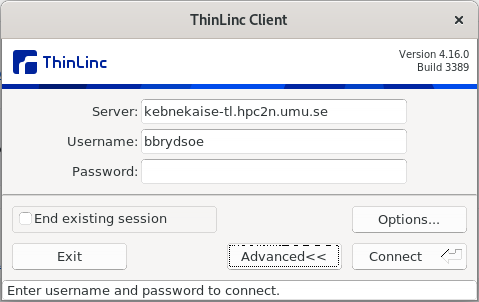
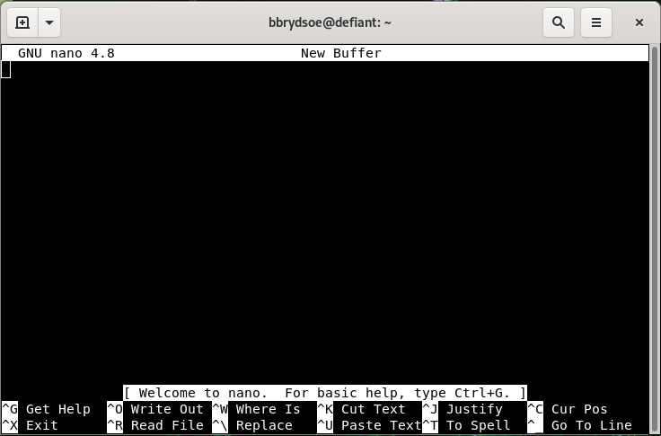
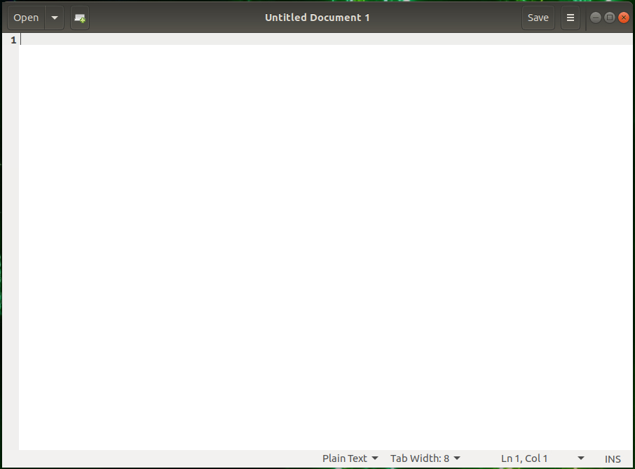

# Logging in 

When you have your account, you can login to Kebnekaise. This can be done with any number of SSH clients or with ThinLinc (the easiest option if you need a graphical interface). 

!!! Objectives 

    - Login to Kebnekaise, either with ThinLinc or your SSH client of choice. 

## Kebnekaise login servers 

!!! note

    - The main login node of Kebnekaise: <code>kebnekaise.hpc2n.umu.se</code>
    - ThinLinc login node: <code>kebnekaise-tl.hpc2n.umu.se</code>
        - ThinLinc through a browser (less features): <code>https://kebnekaise-tl.hpc2n.umu.se:300/</code>

In addition, there is a login node for the AMD-based nodes. We will talk more about this later: <code>kebnekaise-amd.hpc2n.umu.se</code>. For ThinLinc access: <code>kebnekaise-amd-tl.hpc2n.umu.se</code>

!!! NOTE "ThinLinc is recommended for this course"

    ThinLinc: a cross-platform remote desktop server from Cendio AB. Especially useful when you need software with a graphical interface.

    This is what we recommend you use for this course, unless you have a preferred SSH client. 

### Using ThinLinc 

- Download the client from <a href="https://www.cendio.com/thinlinc/download" target="_blank">https://www.cendio.com/thinlinc/download</a>. 
    - Install it.
        - Windows: Run the downloaded .exe file to install. 
        - macOS: Information on the <a href="https://www.cendio.com/resources/docs/tag/client_macos.html#installing-the-macos-client" target="_blank">ThinLinc macOS info page</a>. 
        - Linux Ubuntu: Download the .deb file. Run ``sudo dpkg -i PATH-TO-FILE/FILE-YOU-DOWNLOADED.deb`` 
- Start the client. 
- Enter the name of the server: <code>kebnekaise-tl.hpc2n.umu.se</code>. Enter your username. 
<br style="clear: both;">
{: styles="width: 30%;"}
<br style="clear: both;">
- Go to "Options" $->$ "Security". Check that authentication method is set to password.
- Go to "Options" $->$ "Screen". Uncheck "Full screen mode".
- Enter your HPC2N password. Click "Connect"
- Click "Continue" when you are being told that the server's host key is not in the registry. Wait for the ThinLinc desktop to open.

### Password

You get your first, temporary HPC2N password from this page: <a href="https://www.hpc2n.umu.se/forms/user/suprauth?action=pwreset" target="_blank">HPC2N passwords</a>.

That page can also be used to reset your HPC2N password if you have forgotten it.

Note that you are authenticating through SUPR, using *that* service’s login credentials!

!!! Warning

    The HPC2N password and the SUPR password are separate! The HPC2N password and your university/department password are also separate!

!!! Exercise "Exercise" 

    Login to Kebnekaise. 

    - If you are using ThinLinc, first install the ThinLinc client. If you are using another SSH client, install it first if you have not already done so.

## Change password

!!! Exercise "Exercise: Change your password after first login" 

    **ONLY do this if you have logged in for the first time/is still using the termporary password you got from the HPC2N password reset service!** 

    Changing password is done using the passwd command:

    ```bash
    passwd
    ```

    Use a good password that combines letters of different case. Do not use dictionary words. Avoid using the same password that you also use in other places.

    It will first ask for your current password. Type in that and press enter. Then type in the new password, enter, and repeat. You have changed the password.

## File transfers 

We are not going to transfer any files as part of this course, but you may have to do so as part of your workflow when using Kebnekaise (or another HPC centre) for your research. 

This section will only talk briefly about file transfers. You can find more information and examples on HPC2N's [File transfer documentation](https://docs.hpc2n.umu.se/documentation/filesystems/#file__transfer). 

### Linux, OS X

#### scp

SCP (Secure CoPy) is a simple way of transferring files between two machines that use the SSH (Secure SHell) protocol. You may use SCP to connect to any system where you have SSH (log-in) access. 

These examples show how to use scp from the command-line. Graphical programs exists for doing scp transfer. 

The command-lone scp program should already be installed. 

!!! note "Remote to local"

    Transfer a file from Kebnekaise to your local system, while on your local system

    ```bash
    scp username@kebnekaise.hpc2n.umu.se:file .
    ```

!!! note "Local to remote"

    Transfer a local file to Kebnekaise, while on your local system 

    ```bash
    scp file username@kebnekaise.hpc2n.umu.se:file
    ```

!!! note "Recursive directory copy from a local system to a remote system"

    The directory <code>sourcedirectory</code> is here copied as a subdirectory to <code>somedir</code>

    ```bash
    scp -r sourcedirectory/ username@kebnekaise.hpc2n.umu.se:somedir/
    ```

#### sftp 

SFTP (SSH File Transfer Protocol or sometimes called Secure File Transfer Protocol) is a network protocol that provides file transfer over a reliable data stream.

SFTP is a command -line program on most Unix, Linux, and Mac OS X systems. It is also available as a protocol choice in some graphical file transfer programs. 

!!! Example "Example: From a local system to a remote system"

    ```bash
    enterprise-d [~]$ sftp user@kebnekaise.hpc2n.umu.se
    Connecting to kebnekaise.hpc2n.umu.se...
    user@kebnekaise.hpc2n.umu.se's password:
    sftp> put file.c C/file.c
    Uploading file.c to /home/u/user/C/file.c
    file.c                          100%    1    0.0KB/s   00:00
    sftp> put -P irf.png pic/
    Uploading irf.png to /home/u/user/pic/irf.png
    irf.png                         100% 2100    2.1KB/s   00:00
    sftp>
    ```

### Windows

Here you need to download a client: WinSCP, FileZilla (sftp), PSCP/PSFTP, ...

You can transfer with sftp or scp. 

There is documentation in HPC2N's documentation pages for <a href="https://docs.hpc2n.umu.se/tutorials/connections/#file__transfers" target="_blank">Windows file transfers</a>. 

## Editors

Since the editors on a Linux system are different to those you may be familiar with from Windows or macOS, here follows a short overview. 

There are command-line editors and graphical editors. If you are connecting with a regular SSH client, it will be simplest to use a command-line editor. If you are using ThinLinc, you can use command-line editors or graphical editors as you want. 

### Command-line

These are all good editors for using on the command line: 

- <a href="https://www.nano-editor.org/" target="_blank">nano</a>
- <a href="https://en.wikipedia.org/wiki/Vi" target="_blank">vi</a>, <a href="https://en.wikipedia.org/wiki/Vim_(text_editor)" target="_blank">vim</a>
- <a href="https://www.gnu.org/software/emacs/" target="_blank">emacs</a>

They are all installed on Kebnekaise.

Of these, <code>vi/vim</code> as well as <code>emacs</code> are probably the most powerful, though the latter is better in a GUI environment. The easiest editor to use if you are not familiar with any of them is <code>nano</code>.

!!! note "Nano"

    1. Starting “nano”: Type <code>nano FILENAME</code> on the command line and press <code>Enter</code>. <code>FILENAME</code> is whatever you want to call your file.
    2. If <code>FILENAME</code> is a file that already exists, <code>nano</code> will open the file. If it dows not exist, it will be created.
    3. You now get an editor that looks like this:
    {: style="width: 99%;"}
    4. First thing to notice is that many of the commands are listed at the bottom.
    5. The <code>^</code> before the letter-commands means you should press <code>CTRL</code> and then the letter (while keeping <code>CTRL</code> down).
    6. Your prompt is in the editor window itself, and you can just type (or copy and paste) the content you want in your file.
    7. When you want to exit (and possibly save), you press <code>CTRL</code> and then <code>x</code> while holding <code>CTRL</code> down (this is written <code>CTRL-x</code> or <code>^x</code>). <code>nano</code> will ask you if you want to save the content of the buffer to the file. After that it will exit.

There is a <a href="https://www.nano-editor.org/dist/latest/nano.html" target="_blank">manual for <code>nano</code> here</a>.

### GUI

If you are connecting with [ThinLinc](#using__thinlinc), you will be presented with a graphical user interface (GUI). 

From there you can either 

- open a terminal window/shell (<code>Applications</code> -> <code>System Tools</code> -> <code>MATE Terminal</code>) 
- or you can choose editors from the menu by going to <code>Applications</code> -> <code>Accessories</code>. This gives several editor options, of which these have a graphical interface:
    - <a href="https://help.gnome.org/users/gedit/stable/" target="_blank">Text Editor (gedit)</a>
    - <a href="https://en.wikipedia.org/wiki/Pluma_(text_editor)" target="_blank">Pluma</a> - the default editor on the MATE desktop environments (that Thinlinc runs)
    - <a href="https://en.wikipedia.org/wiki/Atom_(text_editor)" target="_blank">Atom</a> - not just an editor, but an IDE
    - <a href="https://www.gnu.org/software/emacs/" target="_blank">Emacs (GUI)</a>
    - <a href="https://en.wikipedia.org/wiki/NEdit" target="_blank">NEdit “Nirvana Text Editor”</a>

If you are not familiar with any of these, a good recommendation would be to use <code>Text Editor/gedit</code>.

!!! Example "Text Editor/gedit"

    1. Starting “<code>gedit</code>”: 
        - From the menu, choose <code>Applications</code> -> <code>Accessories</code> -> <code>Text Editor</code>.
    2. You then get a window that looks like this:
    {: style="width: 99%;"} 
    3. You can open files by clicking “<code>Open</code>” in the top menu.
    4. Clicking the small file icon with a green plus will create a new document.
    5. Save by clicking “<code>Save</code>” in the menu.
    6. The menu on the top right (the three horizontal lines) gives you several other options, including “<code>Find</code>” and “<code>Find and Replace</code>”.

## HPC2N Open OnDemand desktop (teaser) 

HPC2N is currently working on another way to connect to our systems, through an "Open OnDemand desktop". If you have used LUNARC's systems, you may have tried their desktop OnDemand. 

<!-- Link: <a href="https://portal.hpc2n.umu.se/" target="_blank">https://portal.hpc2n.umu.se/</a> --> 

Open OnDemand is a web service that allows HPC users to schedule jobs, run notebooks and work interactively on a remote cluster from any device that supports a modern browser. The Open OnDemand project was funded by NSF and is currently maintained by the <a href="https://www.osc.edu/" target="_blank">Ohio SuperComputing Centre</a>. Read more about OpenOnDemand at <a href="https://openondemand.org/" target="_blank">OpenOndemand.org</a>. 

!!! note "Keypoints"

    - You can login with ThinLinc or another SSH client
    - ThinLinc is easiest if you need a GUI
    - There are several command-line editors: vi/vim, nano, emacs, ...
    - And several GUI editors, which works best when using ThinLinc: gedit, pluma, atom, emacs (gui), nedit, ... 


