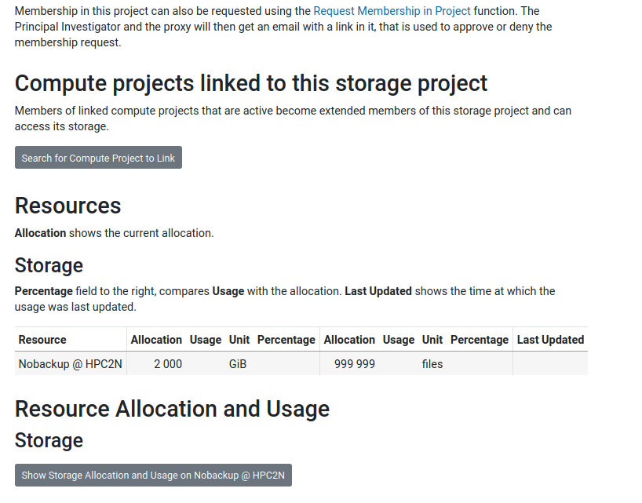
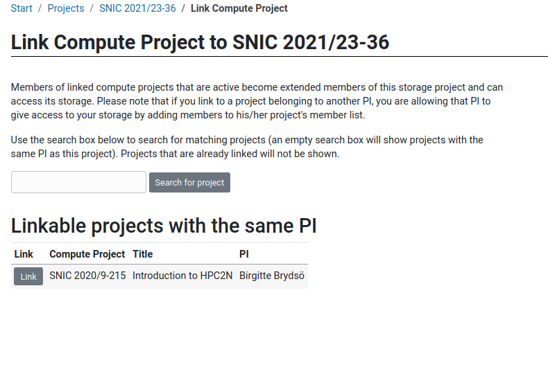
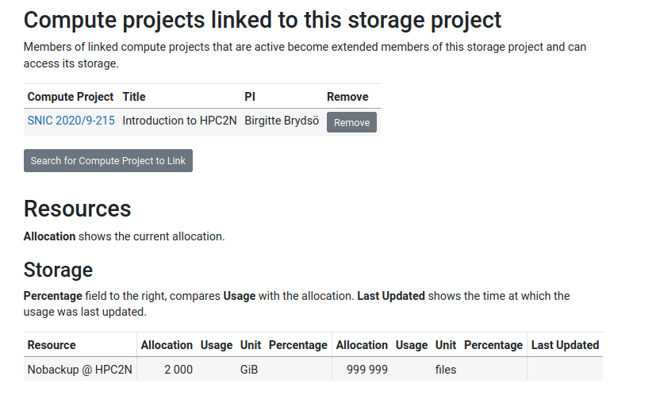
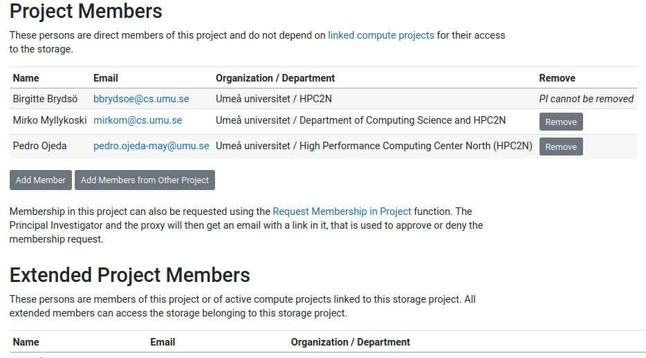

# Projects - compute and storage

!!! Note 

    In order to have an account at HPC2N, you need to be a member of a **compute** project. 

    You can either join a project or apply for one yourself (if you fulfill the requirements). 

There are both storage projects and compute projects. The storage projects are for when the amount of storage included with the compute project is not enough. 

!!! important

    You cannot have a storage project without a compute project! 

!!! Warning "Kebnekaise is only open for local project requests!" 

    - The PI must be affiliated with UmU, LTU, IRF, MiUN, or SLU.
    - You can still add members (join) from anywhere.

## Application process  

Apply for **compute projects** in [SUPR](https://supr.naiss.se/round/compute). 

- Login to SUPR (create SUPR account if you do not have one).
- Click “Rounds” in the left menu. Pick “Compute Rounds”. Pick “Centre Local Compute”.
- Pick “HPC2N Local Compute YYYY”. Choose “Create New Proposal for HPC2N Local Compute YYYY”.
- Create from scratch or use earlier proposal as starting point.
- Agree to the default storage if 500GB is enough. 
- More information: [https://supr.naiss.se/round/open_or_pending_type/?type=Centre+Local+Compute](https://supr.naiss.se/round/open_or_pending_type/?type=Centre+Local+Compute) 
- If the above mentioned default storage is not enough, you will need to apply for a **Local storage project**: [https://supr.naiss.se/round/open_or_pending_type/?type=Centre+Local+Storage](https://supr.naiss.se/round/open_or_pending_type/?type=Centre+Local+Storage) 

!!! Note "Info"

    - As default, you have 25GB in your home directory.
    - If you need more, you/your PI can accept the "default storage" you will be offered after applying for compute resources.
    - The default storage is 500GB.
    - If you need more than that, you/your PI will have to apply for a storage project.
    - When you have both, link them together. It is done from the **storage** project. 
    - This way all members of the compute project also becomes members of the storage project.

After applying on SUPR, the project(s) will be reviewed.

### Linking a compute project to a storage project

1. Before linking (SUPR): 

{: style="width: 90%;"}
  
2. Pick a compute project to link:

{: style="width: 90%;"} 
 
3. Showing linked projects:

{: style="width: 90%;"}
  
4. Members of the storage project after linking:

{: style="width: 90%;"} 
  

## Accounts 

When you have a project / have become member of a project, you can apply for an account at HPC2N. This is done in SUPR, under "Accounts": [https://supr.naiss.se/account/](https://supr.naiss.se/account/). 

Your account request will be processed within a week. You will then get an email with information about logging in and links to getting started information. 

More information on the account process can be found on HPC2N's documentation pages: [https://www.hpc2n.umu.se/documentation/access-and-accounts/users](https://www.hpc2n.umu.se/documentation/access-and-accounts/users) 

