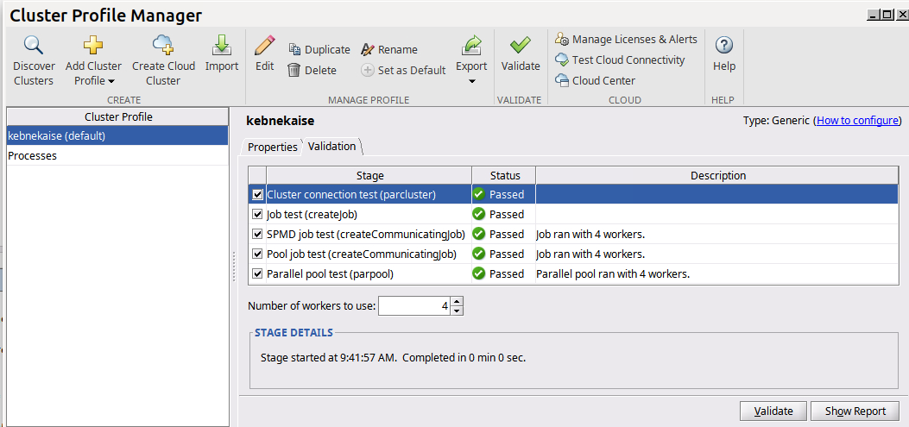
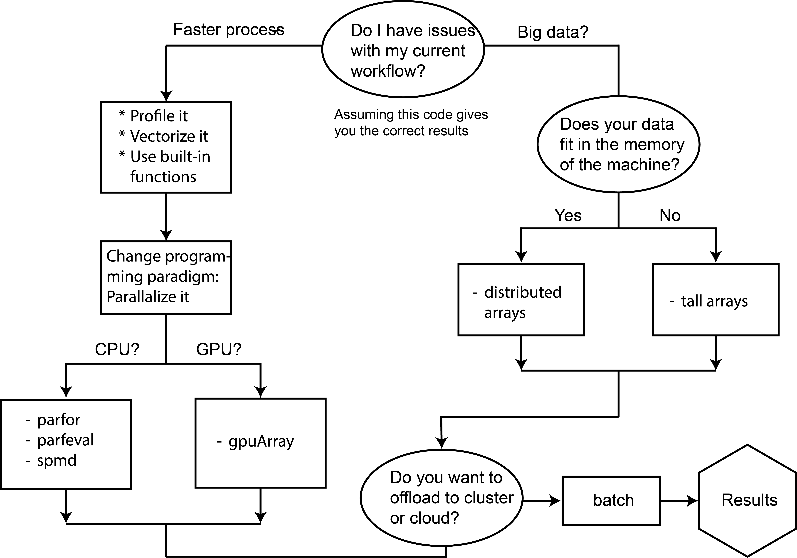
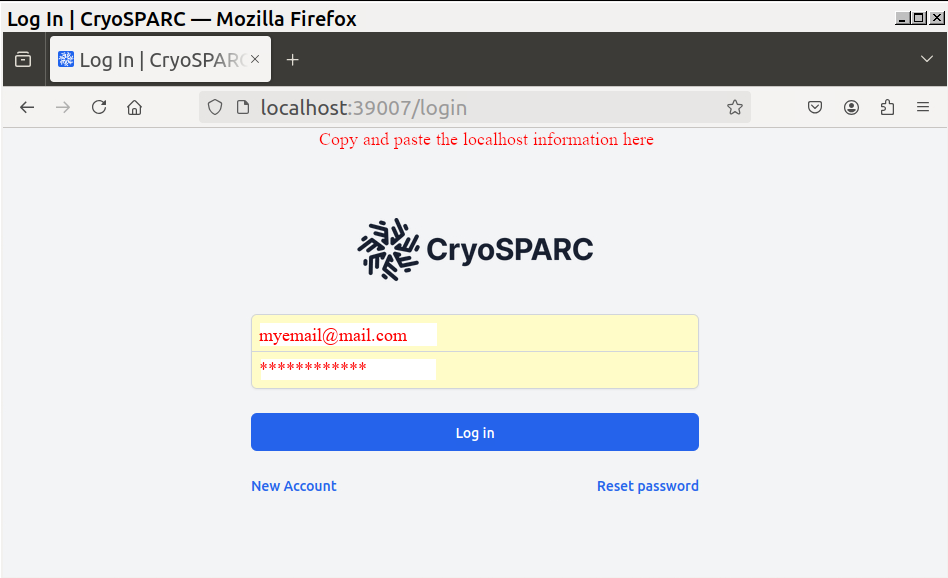

# Application examples

??? important "Create a soft-link to your storage project" 

    It will be very convinient to create a soft-link to your storage project in your
    home directory for a faster navigation:

    ```bash
         cd $HOME
         ln -s /proj/nobackup/hpc2n202X-XYZ choose-a-name
    ```

??? important "Monitoring the use of resources"

    Most likely you will allocate many cores and many GPUs for your simulations. You can
    monitor the use of these resources with the ``job-usage job_ID`` command, where ``job_ID``
    is the output number of the ``sbatch`` command. You can also see this number if you type
    ``squeue -u my-username``. ``job-usage`` outputs a url that you can copy/paste in your
    local browser where you can see how resources are being used:

    

## Matlab

### How to find Matlab 

Matlab is available through the Menu bar if you are using ThinLinc client (recommended). Additionally, you can load 
a Matlab module on a Linux terminal on Kebnekaise. Details for these two options can be found 
[here](https://www.hpc2n.umu.se/resources/software/matlab){:target="_blank"}. 

### First time configuration

The first time you access Matlab on Kebnekaise, you need to configure it by following these guidelines 
[Configuring Matlab](https://www.hpc2n.umu.se/resources/software/configure-matlab-2018){:target="_blank"}. After configuring the cluster, it is a good practice to validate the
cluster (HOME -> Parallel -> Create and Manage Clusters):



Notice that it is recommended to use a small number of workers for the validation, in this case 4. 

### Tools for efficient simulations 

Chart flow for a more efficient Matlab code using existing tools (adapted from[^1])



!!! important "MATLAB on GPUs" 

    Notice that MATLAB currently supports only NVIDIA GPUs (v100,a40,a6000,a100,l40s,h100),
    with v100 and l40s being the most abundant (10 nodes each).

!!! Warning "Use MATLAB for lightweight tasks on the login nodes" 

    Remember that login nodes are used by many users and if you run heavy jobs there,
    you will interfere with the workflow of them.

### Exercises

??? Note "Exercise 1: Matlab serial job"
 
    The folder ``SERIAL`` contains a function [funct.m](https://raw.githubusercontent.com/hpc2n/intro-course/master/exercises/MATLAB/SERIAL/funct.m){:target="_blank"} 
    which performs a FFT on a matrix.
    The execution time is obtained with tic/toc and written down in the output file called
    **log.out**. Run the function by using the MATLAB GUI with the help of the script [submit.m](https://raw.githubusercontent.com/hpc2n/intro-course/master/exercises/MATLAB/SERIAL/submit.m){:target="_blank"}.

    As an alternative, you can submit the job via a batch script 
    [job.sh](https://raw.githubusercontent.com/hpc2n/intro-course/master/exercises/MATLAB/SERIAL/job.sh){:target="_blank"}. 
    Here, you will need to fix the *Project_ID* with the one provided for the present course and the Matlab version.


??? Note "Exercise 2: Matlab parallel job"

    * ``PARFOR`` folder contains an [example](https://raw.githubusercontent.com/hpc2n/intro-course/master/exercises/MATLAB/PARFOR/parallel_example.m){:target="_blank"} of a parallelized loop with the "parfor" directive. A pause()
    function is included in the loop to make it heavy. This function can be
    submitted to the queue by running the script [submit.m](https://raw.githubusercontent.com/hpc2n/intro-course/master/exercises/MATLAB/PARFOR/submit.m){:target="_blank"} in the MATLAB GUI.
    The number of workers can be set by replacing the string *FIXME* (in the "submit.m"
    file) with the number you desire. 
      Try different values for the number of workers from 1 to 10 and take a note
      of the simulation time output at the end of the simulation. Where does the
      code achieve its peak performance? 

    * ``SPMD`` folder presents an example of a parallelized code using [SPMD](https://raw.githubusercontent.com/hpc2n/intro-course/master/exercises/MATLAB/SPMD/spmdex.m){:target="_blank"} paradigm. Submit this job to the queue through the MATLAB GUI. This
    example illustrates the use of *parpool* to run parallel code in a more interactive manner.

??? Note "Exercise 3: Matlab GPU job"

    ``GPU`` folder contains a test case that computes a Mandelbrot set both 
    on CPU [mandelcpu.m](https://raw.githubusercontent.com/hpc2n/intro-course/master/exercises/MATLAB/GPU/mandelcpu.m){:target="_blank"} 
    and on GPU [mandelgpu.m](https://raw.githubusercontent.com/hpc2n/intro-course/master/exercises/MATLAB/GPU/mandelgpu.m){:target="_blank"}. You can submit the jobs through 
    the MATLAB GUI using the [submitcpu.m](https://raw.githubusercontent.com/hpc2n/intro-course/master/exercises/MATLAB/GPU/submitcpu.m){:target="_blank"} and [submitgpu.m](https://raw.githubusercontent.com/hpc2n/intro-course/master/exercises/MATLAB/GPU/submitgpu.m){:target="_blank"}  files. 

    The final output if everything ran well are two .png figures
    which display the timings for both architectures. Use the "eom" command on the
    terminal to visualize the images (eom out-X.png)

## R

### How to find R

Similar to Matlab, R is available through the Menu bar if you are using ThinLinc client (recommended). Additionally, you can load 
a Matlab module on a Linux terminal on Kebnekaise. Details for these two options can be found 
[here](https://www.hpc2n.umu.se/resources/software/r){:target="_blank"}. 

### First time configuration

The first time you access R on Kebnekaise, you need to configure it by following the 
[Preparations](https://www.hpc2n.umu.se/resources/software/user_installed/r){:target="_blank"} step.

### Recommendations

??? Warning "Be aware of data duplication in R"

    Some parallel functions ``mcapply`` in this example, tend to replicate the data for 
    the workers (cores) if the dataframe is modified by them. This can be crucial if you
    are working with a large data frame and you are employing several parallel functions,
    for instance during the training of machine learning models because your simulation could
    easily exceed the available memory per node.

    ```bash
       library(parallel)
       library(pryr)
 
       prev <- mem_used()                                                         
       print(paste("Memory initially allocated by R:", prev/1e6, "MB"))
 
       # Define a relatively large dataframe
       data_df <- data.frame(
       ID = seq(1, 1e7),
       Value = runif(1e7)
       )
 
       # Create a function to be applied to each row (or a subset of rows)
       process_function <- function(i, df) {
       # do some modification the i-th row 
       return(df$Value[i] * 2)
       }
       prev <- mem_used() - prev
       print(paste("Memory after the serial code execution:", prev/1e6, "MB"))
 
       # Use mclapply to process the dataframe in parallel
       num_cores <- 4
       results <- mclapply(1:nrow(data_df), function(i) process_function(i, data_df), mc.cores = num_cores)
       prev <- mem_used() - prev
       print(paste("Memory after parallel code execution:", prev/1e6, "MB"))
    ```

    In this example [mem-dup.R](https://raw.githubusercontent.com/hpc2n/intro-course/master/exercises/R/MEMDUP/mem-dup.R){:target="_blank"}, I used the function ``mem_used()`` provided by the ``pryr`` package
    to monitor the memory usage. The batch script for this example is [job.sh](https://raw.githubusercontent.com/hpc2n/intro-course/master/exercises/R/MEMDUP/job.sh){:target="_blank"}.

    One possible solution for data duplication could be to use use a data frame for each worker that includes
    only the relevant data for that particular computation.


!!! Warning "Use R for lightweight tasks on the login nodes" 

    Remember that login nodes are used by many users and if you run heavy jobs there,
    you will interfere with the workflow of them.

### Exercises

??? important "Requirements"

    Prior to running the examples, you will need to install several packages.
    Follow these [instructions](https://www.hpc2n.umu.se/resources/software/user_installed/r){:target="_blank"}:

    * The packages needed are:

        For this R version (check if they are not already installed)

        ml GCC/10.2.0 OpenMPI/4.0.5 R/4.0.4

        Rmpi

        doParallel

        caret

        MASS

        klaR

        nnet

        e1071

        rpart

        mlbench

        parallel

??? Note "Exercise 1: R serial job"

    In the ``SERIAL`` folder, a [serial](https://raw.githubusercontent.com/hpc2n/intro-course/master/exercises/R/SERIAL/serial.R){:target="_blank"} is provided. Submit the script 
    [job.sh](https://raw.githubusercontent.com/hpc2n/intro-course/master/exercises/R/SERIAL/job.sh){:target="_blank"} with the command *R CMD* and also with *Rscript*. Where could
    it be more suitable to use *Rscript* over *R CMD*?

    Why do we need the flag **#SBATCH -C 'skylake'** in the batch script?

??? Note "Exercise 2: Job Arrays"

    ``JOB-ARRAYS`` folder shows an [example](https://raw.githubusercontent.com/hpc2n/intro-course/master/exercises/R/JOB-ARRAYS/script_arrays.R){:target="_blank"} for job arrays, the batch file is [job.sh](https://raw.githubusercontent.com/hpc2n/intro-course/master/exercises/R/JOB-ARRAYS/job.sh){:target="_blank"}. Submit the
    script and notice what is written in the output files. 
    
    Could you use job arrays in your simulations if you need to run many simulations where some parameters are changed? As an example, imagine that you need to run 28 simulations 
    where a single parameter, such as the temperature, is changed from 2 to 56 C. Could you 
    use the variable *task_id* in the previous script to get that range of temperatures so
    that each simulation prints out a different temperature?

??? Note "Exercise 3: Parallel jobs with Rmpi"

    In the folder ``RMPI``, you can find the R script [Rmpi.R](https://raw.githubusercontent.com/hpc2n/intro-course/master/exercises/R/RMPI/Rmpi.R){:target="_blank"} which uses 5
    MPI slaves to apply the runif() function on an array "c". The submit file is
    [job_Rmpi.sh](https://raw.githubusercontent.com/hpc2n/intro-course/master/exercises/R/RMPI/job_Rmpi.sh){:target="_blank"}. As a result, you will see the random numbers
    generated by the slaves in the slurm output file

??? Note "Exercise 4: Parallel jobs with doParallel"

    The folder ``DOPARALLEL`` contains two examples:

       1. [doParallel.R](https://raw.githubusercontent.com/hpc2n/intro-course/master/exercises/R/DOPARALLEL/FOREACH/doParallel.R){:target="_blank"} 
          shows how to use the **foreach** function in sequential mode
          (1 core) and the parallel mode using 4 cores. What is the difference in the usage
          of **foreach** for these two modes?
          
          Submit the [job_doParallel.sh](https://raw.githubusercontent.com/hpc2n/intro-course/master/exercises/R/DOPARALLEL/FOREACH/job_doParallel.sh){:target="_blank"} script and compare the timings of the
          sequential and parallel codes.

          How many *workers* are allocated for this simulation? If you want to allocate
          more or less, what changes must be made to these files?

       2. [doParallel_ML.R](https://raw.githubusercontent.com/hpc2n/intro-course/master/exercises/R/DOPARALLEL/ML/doParallel_ML.R){:target="_blank"} presents the evaluation of several ML models in both
       sequential and parallel modes using the standard "iris" database. The 
       difference is basically in the use of %dopar% instead of %do% function. 

          Submit the batch script [job_doParallel_ML.sh](https://raw.githubusercontent.com/hpc2n/intro-course/master/exercises/R/DOPARALLEL/ML/job_doParallel_ML.sh){:target="_blank"} to the queue.

          In the output file observe the resulting elapsed times for the sequential
          and the 4 cores parallel simulation.

          Upon submitting the job to the queue you will get a number called job ID.
          Use the command:

          ``job-usage job_ID``

          to obtain a URL which you can copy/paste in your local browser. Tip: refresh
          your browser several times to get the statistics. 

          Can you see how the CPU is used? What about the memory?

          Note 1: In order to run this exercise, you need to have all the packages 
          listed at the beginning of this document installed. 

          Note 2: If you want to try a different number of cores for running the 
          scripts, you should change that number in both the *.R and *.sh scripts

??? Note "Exercise 5: Machine Learning jobs"

    In the folder ``ML`` we show a ML model using a sonar database
    and Random Forest as the training method ([Rscript.R](https://raw.githubusercontent.com/hpc2n/intro-course/master/exercises/R/ML/Rscript.R){:target="_blank"}). The simulations are done both in serial
    and parallel modes. You may change the values for the number of cores (1 in the present case) 
    to other values. Notice that the number of cores needs to be the same in the
    files [job.sh](https://raw.githubusercontent.com/hpc2n/intro-course/master/exercises/R/ML/job.sh){:target="_blank"} and [Rscript.R](https://raw.githubusercontent.com/hpc2n/intro-course/master/exercises/R/ML/Rscript.R){:target="_blank"}. 

    Try a different number of cores and monitor the timings which are reported at
    the end of the output file.

## Alphafold

### How to find Alphafold

Alphafold is installed as a module. Notice that on the Intel nodes there are more
versions of Alphafold installed than on the AMD nodes. Thus, if you are targeting one
version that is only installed on the Intel nodes, you will need to add the instruction
``#SBATCH -C skylake`` to your batch script, otherwise the job could arrive to an
AMD node that lacks that installation. 

### Exercises

??? Note "Exercise 1: Running a monomer protein simulation"

    In the folder ``ALPHAFOLD`` you will find a [fasta secuence](https://raw.githubusercontent.com/hpc2n/intro-course/master/exercises/ALPHAFOLD/my_fasta_sequence.fasta){:target="_blank"} for a monomer and the 
    corresponding batch file [job.sh](https://raw.githubusercontent.com/hpc2n/intro-course/master/exercises/ALPHAFOLD/job.sh){:target="_blank"} for running the simulation on
    GPUs. Try running the simulation with CPUs only and then with l40s, v100 and a100 GPUs. 

    Notice that the simulation will take ~1hrs. so the purpose of this exercise is to know
    if the simulation starts running well only.

## CryoSPARC

### How to find CryoSPARC 

The version 4.5.3 of CryoSPARC is installed as a module. 

### First time configuration

One needs a license for using this software. For
academic purposes a free of charge license can be requested at the website
[cryosparc.com](https://cryosparc.com/){:target="_blank"} (one working day for the processing). 
Once you obtain your license ID copy it, create a file called ``/home/u/username/.cryosparc-license`` and paste
it in the first line of this file. In the second line of the file write your email address. 

### Using CryoSPARC on Kebnekaise

Create a suitable folder in your project directory, for instance ``/proj/nobackup/hpc2n202X-XYZ/cryosparc``
and move into this folder. Download/copy the ``lane*tar`` files that are located [here](https://github.com/hpc2n/intro-course/tree/master/exercises/CRYOSPARC){:target="_blank"} to the cryosparc folder and untar them here (``tar -xvf lane_CPU.tar`` as an example).

??? Important "Fix your Project_ID and time" 

    Change the string *Project_ID* in the file ``lane*/cluster_script.sh`` to reflect your current project.
    Also, the time was set to 20 min. in these files but for your realistic simulations you can change it to
    longer times (``-t 00:20:00``).

The lanes should be recognized by CryoSPARC when it starts running.

Load the CryoSPARC modules. Start CryoSPARC and accept the request which asks about continuing using
cryostart and that the folder was not used before. List the users on the server (which should be only yourself
for this type of license), check the email address that is displayed for this user (it should be the one you
added in the license file) and reset the password to. These steps are summarized here:

```bash
$cryosparc start 
...
Do you wish to continue starting cryosparc? [yN]: y
...
CryoSPARC master started. 
 From this machine, access CryoSPARC and CryoSPARC Live at
    http://localhost:39007
...

$cryosparc listusers
cryosparc resetpassword --email "myemail@mail.com" --password "choose-a-password"
```

Copy and paste the line which has the localhost port (notice that port number can change) to a browser on Kebnekaise:



After loging in, you will be able to see the CryoSPARC's dashboard:


There are several tutorials at the CryoSPARC website, in the previous picture I followed the
[Introductory Tutorial (v4.0+)](https://guide.cryosparc.com/processing-data/get-started-with-cryosparc-introductory-tutorial#step-3-download-the-tutorial-dataset){:target="_blank"}. 

!!! Important "Use ``cryosparc`` instead of ``cryosparcm``" 

    On Kebnekaise the command ``cryosparc`` should be used and not the one cited in the tutorial ``cryosparcm``

Depending on the job type, CryoSPARC would suggest the hardware resources. For instance, in the tutorial
above *Step 4: Import Movies* suggests using 1 CPU upon queueing it, but *Step 5: Motion Correction* suggests
using 1 GPU. For CPU-only jobs you can choose the CPU lane, and if your job uses GPUs you can choose 
among L40s, V100, A100, and H100. Notice that the V100 and L40s are the most abundant at the moment:


!!! Keypoints "Keypoints" 

    - The software on Kebnekaise is mostly accessed through the module system.

## References

[^1]: <a href="https://se.mathworks.com/help/parallel-computing/choosing-a-parallel-computing-solution.html" target="_blank">MathWorks documentation on Parallel Computing</a>
